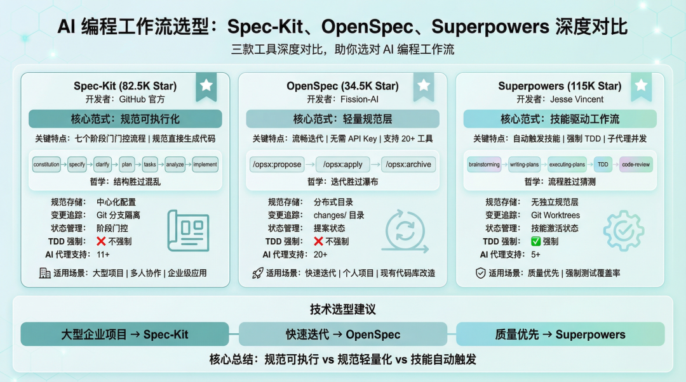
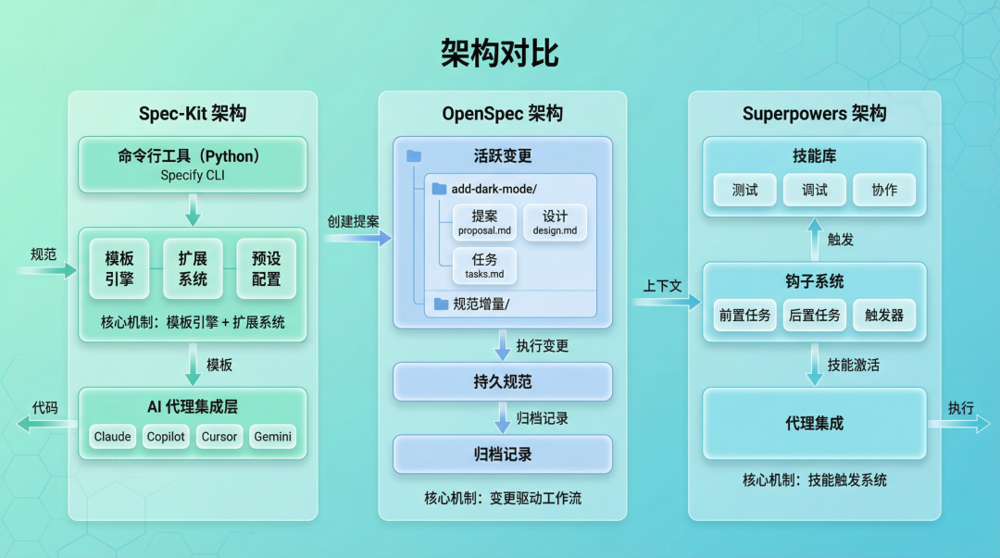
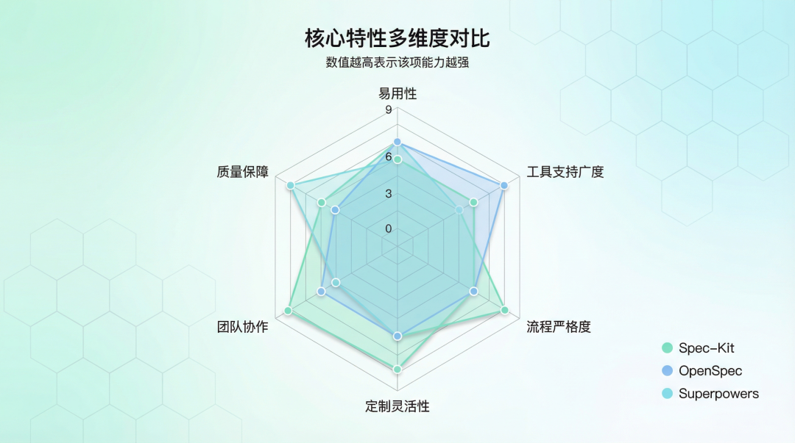
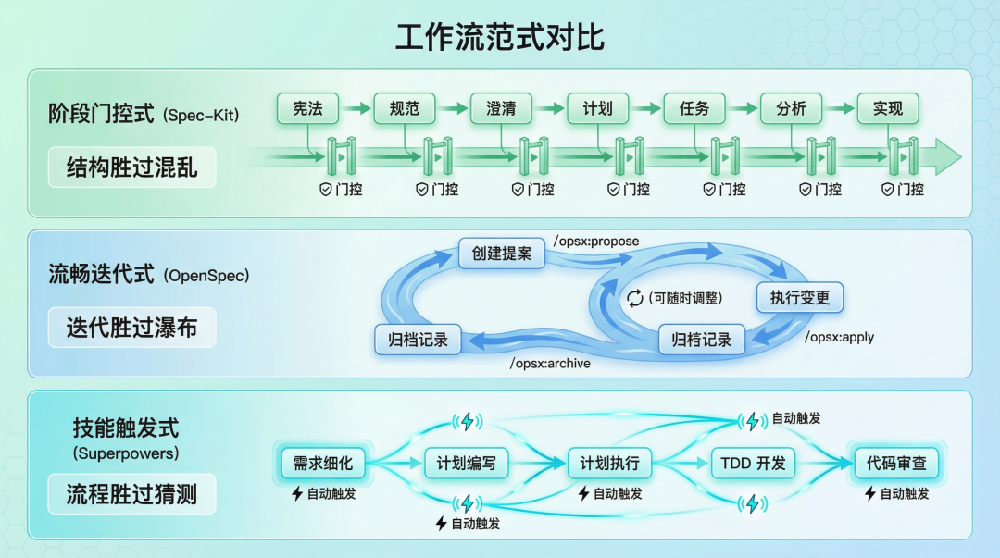
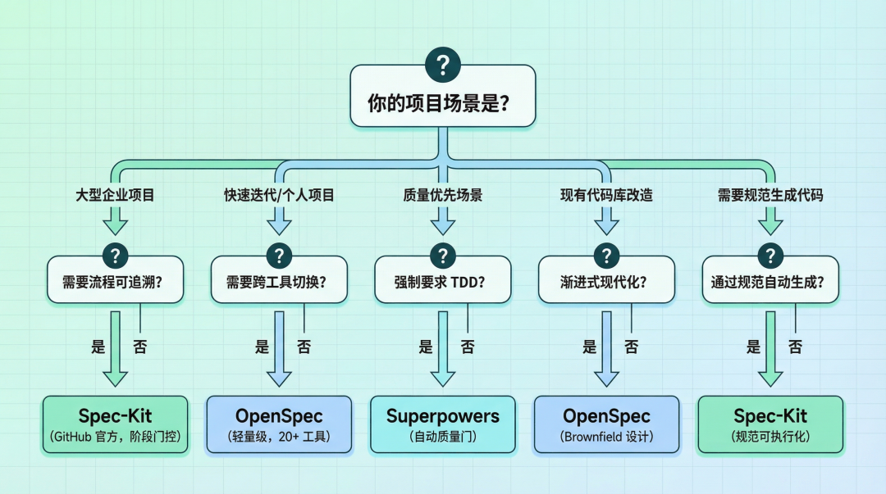

# AI 编程工作流选型：Spec-Kit、OpenSpec、Superpowers 深度对比

> 🚩 2026 年「术哥无界」系列实战文档 X 篇原创计划 第 _64_ 篇，AI 编程最佳实战「2026」系列第 _8_ 篇

AI 编程工作流选型对比



_图 1：Spec-Kit、OpenSpec、Superpowers 三款 AI 编程工作流工具对比_

用 AI 编程代理写代码，你有没有遇到过这些问题：

- 代理写出的代码风格飘忽不定，每次都要重新解释项目规范
- 多人协作时代理理解不一致，同样的需求给出完全不同的实现
- 想让代理遵循测试驱动开发，但它总爱跳过测试直接写代码

这些问题背后是同一个核心矛盾：**AI 代理缺乏结构化的工作流约束**。

解决方案有三个热门选手：GitHub 官方的 **Spec-Kit**（82.5K Star）、轻量级的 **OpenSpec**（34.5K Star）、技能驱动的 **Superpowers**（115K Star）。看着都是"规范驱动"，但底层哲学完全不同——选错了就是工具束缚人。

### 1. 三者的背景与定位

#### Spec-Kit：规范可执行化

GitHub 官方出品，由 Den Delimarsky 和 John Lam 等核心开发者维护。

官方定位很明确：

> **Spec-Driven Development flips the script on traditional software development. Specifications become executable, directly generating working implementations rather than just guiding them.**

翻译过来：规范不只是"指导文档"，而是**可执行的**——能直接生成工作代码。

Spec-Kit 的核心是七个阶段：`constitution`（项目治理）→ `specify`（定义需求）→ `clarify`（澄清模糊）→ `plan`（技术计划）→ `tasks`（任务分解）→ `analyze`（一致性检查）→ `implement`（执行实现）。

#### OpenSpec：轻量规范层

Fission-AI 团队开发，核心理念是四个词：**fluid、iterative、easy、built for brownfield**。

官方定义：

> **A lightweight spec-driven framework for coding agents and CLIs — universal, open source, and no API keys or MCP required.**

关键点：轻量级、通用、**无需 API Key 和 MCP**。

OpenSpec 不追求"规范生成代码"，而是做一层轻量的规范管理——通过 `/opsx:propose`（创建提案）→ `/opsx:apply`（执行）→ `/opsx:archive`（归档）的流程，让规范成为活文档。

#### Superpowers：技能驱动工作流

Jesse Vincent（obra）出品，社区规模最大——115K Star。

官方定义：

> **A complete software development workflow for your coding agents, built on top of a set of composable 'skills'.**

关键词：**技能组合**。Superpowers 不是规范驱动，而是通过一组可组合的"技能"来约束代理行为。

核心技能包括：`test-driven-development`（强制 TDD）、`systematic-debugging`（系统化调试）、`brainstorming`（苏格拉底式设计细化）、`subagent-driven-development`（子代理并发执行）等。

### 2. 技术架构深度对比

#### 底层实现机制

**Spec-Kit 的架构**：

```
┌─────────────────────────────────────────────┐
│              Specify CLI (Python)            │
├─────────────────────────────────────────────┤
│  Templates  │  Extensions  │  Presets       │
├─────────────────────────────────────────────┤
│         AI Agent Integration Layer          │
│  Claude │ Copilot │ Cursor │ Gemini │ ...  │
└─────────────────────────────────────────────┘
```

Spec-Kit 基于 Python，使用 `uv` 作为包管理器。核心是**模板引擎 + 扩展系统**——规范通过模板渲染成代码，扩展系统允许自定义工作流。

**OpenSpec 的架构**：

```
openspec/
├── changes/           # 活跃变更
│   └── add-dark-mode/
│       ├── proposal.md
│       ├── design.md
│       ├── tasks.md
│       └── specs/
├── specs/            # 持久规范
└── archive/          # 归档变更
```

OpenSpec 基于 TypeScript，核心是**变更驱动的工作流**。每个功能变更是独立目录，包含提案、设计、任务和规范增量（Spec Delta）。

**Superpowers 的架构**：

```
┌────────────────────────────────────────┐
│           Skills Library               │
│  ┌─────────┐ ┌─────────┐ ┌─────────┐  │
│  │ Testing │ │Debugging│ │  Collab │  │
│  └─────────┘ └─────────┘ └─────────┘  │
├────────────────────────────────────────┤
│           Hooks System                 │
│  Pre-task │ Post-task │ Triggers      │
├────────────────────────────────────────┤
│       Agent Integration                │
└────────────────────────────────────────┘
```

Superpowers 基于 Shell/JavaScript，核心是**技能触发系统**——不是手动调用命令，而是通过 Hook 自动激活相关技能。

#### 数据流对比

| 维度 | Spec-Kit | OpenSpec | Superpowers |
| --- | --- | --- | --- |
| 规范存储 | 中心化配置文件 | 分布式目录结构 | 无独立规范层 |
| 变更追踪 | Git 分支隔离 | changes/ 目录 | Git Worktrees |
| 状态管理 | 阶段门控 | 提案状态 | 技能激活状态 |



### 3. 核心特性对比

| 维度 | Spec-Kit | OpenSpec | Superpowers |
| --- | --- | --- | --- |
| 核心范式 | 规范可执行化 | 轻量规范层 | 技能组合 |
| 主要语言 | Python | TypeScript | Shell/JavaScript |
| Star 数 | 82.5K | 34.5K | 115K |
| 安装方式 | uv tool install | npm install -g | 插件市场/手动配置 |
| AI 代理支持 | 11+ | 20+ | 5+ |
| 是否需要 API Key | 取决于代理 | 不需要 | 取决于代理 |
| 是否需要 MCP | 取决于代理 | 不需要 | 取决于代理 |
| TDD 强制 | 不强制 | 不强制 | 强制 |
| Brownfield 支持 | 支持 | 优先设计 | 支持 |
| 团队协作 | 企业级 | 开发中 | Discord 社区 |
| 学习曲线 | 中等 | 平缓 | 平缓 |
| 定制性 | 高（扩展/预设） | 中等 | 高（技能系统） |



### 4. 工作流范式对比

#### Spec-Kit：阶段门控式

```
constitution → specify → clarify → plan → tasks → analyze → implement
     ↓            ↓         ↓        ↓       ↓        ↓         ↓
   [门控]      [门控]    [门控]   [门控]  [门控]   [门控]    [门控]
```

每个阶段都是一道"门"——必须完成当前阶段才能进入下一阶段。

#### OpenSpec：流畅迭代式

```
/opsx:propose → /opsx:apply → /opsx:archive
      ↓              ↓             ↓
   [提案]         [执行]        [归档]
```

没有严格的阶段门，可以随时调整提案。变更驱动——每个功能是独立的变更目录，完成后归档。

#### Superpowers：技能触发式

```
brainstorming → writing-plans → executing-plans → TDD → code-review
      ↓              ↓               ↓            ↓        ↓
   [自动触发]     [自动触发]       [自动触发]   [自动触发] [自动触发]
```

不是手动调用命令，而是通过上下文自动触发相关技能。



### 5. 实战示例

#### Spec-Kit 实战

```
uv tool install specify-cli --from git+https://github.com/github/spec-kit.git
```

#### OpenSpec 实战

```
npm install -g @fission-ai/openspec@latest
/opsx:propose Add dark mode support to the dashboard
/opsx:apply add-dark-mode
/opsx:archive add-dark-mode
```

#### Superpowers 实战

不需要手动调用命令，技能会自动触发。

### 6. 技术选型建议

| 场景 | 推荐 | 理由 |
| --- | --- | --- |
| 大型企业项目 | Spec-Kit | GitHub 官方维护，阶段门控确保质量 |
| 快速迭代/个人项目 | OpenSpec | 轻量级，学习曲线平缓 |
| 质量优先/强制 TDD | Superpowers | 强制 TDD，质量有保障 |
| 现有代码库改造 | OpenSpec | built for brownfield |
| 跨工具开发 | OpenSpec | 支持 20+ AI 编程工具 |
| 需要规范生成代码 | Spec-Kit | 规范可执行化是核心定位 |



### 7. 三者的局限与权衡

**Spec-Kit 的局限**：相对重量级、阶段门较严格、学习曲线较陡

**OpenSpec 的局限**：规范不直接生成代码、企业功能开发中、社区规模较小

**Superpowers 的局限**：非规范驱动、依赖代理平台、缺少正式文档站点

### 总结

三个工具的核心差异：

- **Spec-Kit**：规范**可执行**，生成代码
- **OpenSpec**：规范**轻量化**，灵活迭代
- **Superpowers**：技能**自动触发**，强制质量

来源：https://cloud.tencent.com/developer/article/2649106
