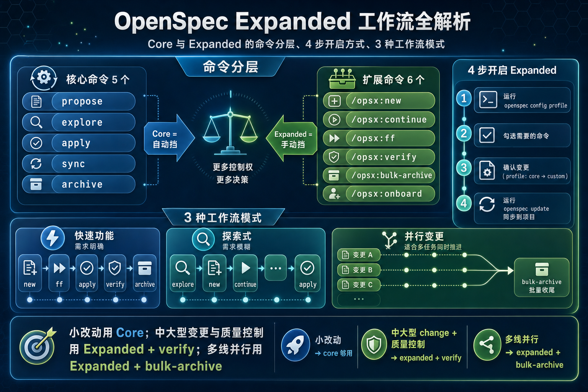
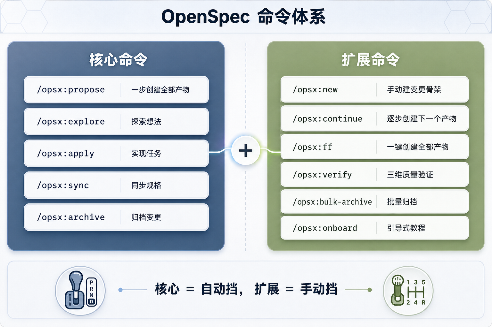
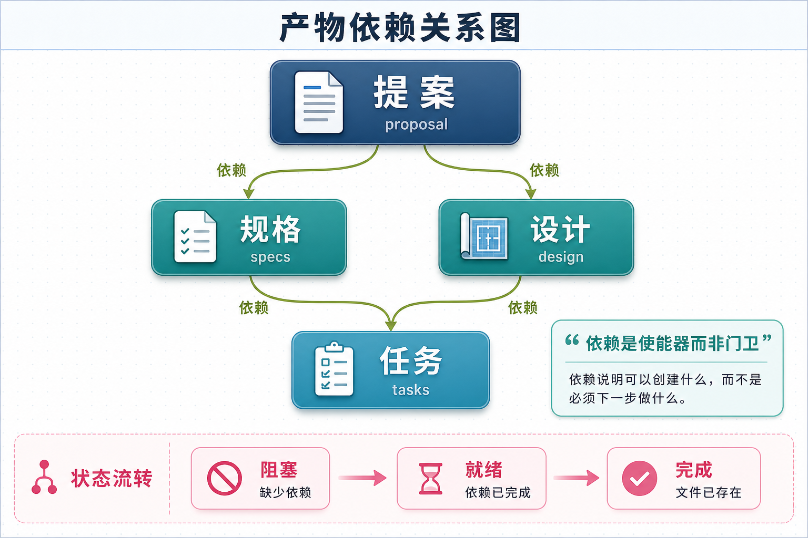
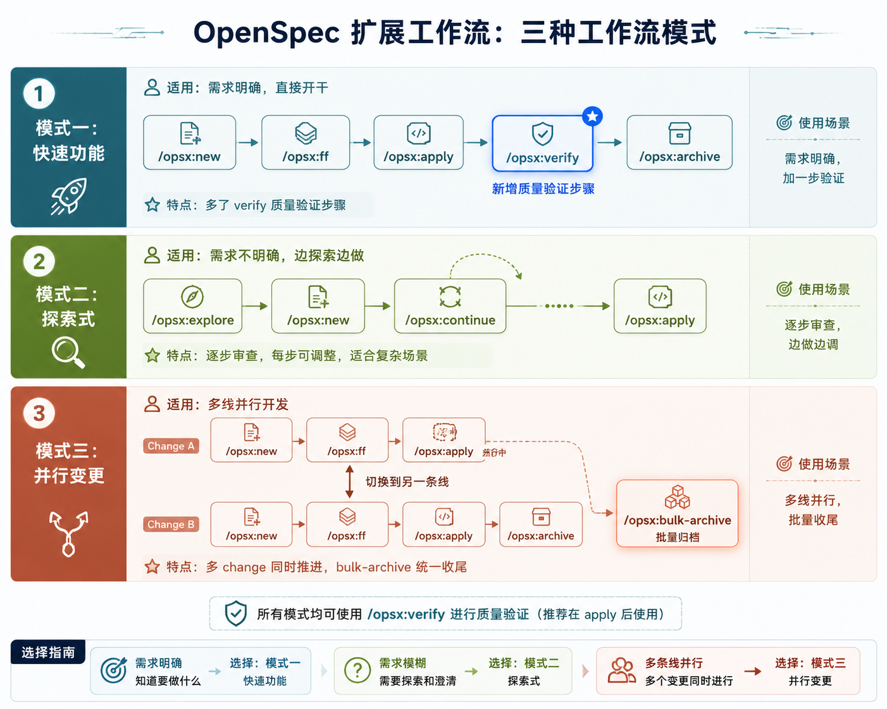

# OpenSpec propose 一步到位太粗糙？4 步开启 6 个扩展命令，从自动挡切手动挡，3 种模式适配不同节奏

> 🚩 2026 年「术哥无界」系列实战文档 X 篇原创计划 第 _112_ 篇，AI 编程最佳实战「2026」系列第 _34_ 篇



## 1. 先搞清楚：Core 和 Expanded 有什么区别

OpenSpec 的命令集通过 **Profile 系统** 动态控制。默认的 `core` profile 只暴露 5 个命令：

```
propose → explore → apply → sync → archive
```

但如果你遇到以下情况，core 就显得力不从心：
- 想在创建规划产物时**逐步审查**
- 实现完成后想**验证质量**
- 同时推进多个 change，需要**批量归档**
- 新上手 OpenSpec，需要**引导式教程**

这些能力都在 **Expanded 命令集**里。OpenSpec 总共提供了 11 个 workflow 命令，core 只给了 5 个，剩下的 6 个需要手动开启。



| 维度 | Core | Expanded |
| --- | --- | --- |
| 启动方式 | `/opsx:propose` 一步创建全部产物 | `/opsx:new` 建骨架 → 再逐步填充 |
| 产物创建 | propose 自动生成全部 | 可逐个创建，每步审查 |
| 质量验证 | 无，直接 apply → archive | `/opsx:verify` 三维验证 |
| 归档能力 | `/opsx:archive` 单个归档 | 加上 `/opsx:bulk-archive` 批量归档 |
| 入门引导 | 无 | `/opsx:onboard` 引导式教程 |

## 2. 4 步开启 Expanded Workflow

### 第一步：运行 `openspec config profile`

选择 **Workflows only**（只改命令集，不动 delivery 模式）。

### 第二步：勾选需要的命令

用**空格键**切换勾选，把 `new`、`continue`、`ff`、`verify`、`bulk-archive`、`onboard` 都选上。

### 第三步：确认变更

```
Config changes:
  profile: core -> custom
  workflows: added new, continue, ff, verify, bulk-archive, onboard
```

### 第四步：运行 `openspec update`

把全局配置同步到当前项目的 AI 工具配置文件里。

## 3. 6 个 Expanded 命令详解

### `/opsx:new` - 手动建 change 骨架

只创建 change 的基础结构（目录 + 元数据），不生成任何规划产物。

### `/opsx:continue` - 创建下一个产物

根据依赖关系，自动创建下一个还缺的产物。你可以审查完一个再推下一个。



### `/opsx:ff` - 快进创建所有产物

fast-forward。一键创建 proposal → specs → design → tasks 全部规划产物。

### `/opsx:verify` - 三维质量验证

最有价值的一个命令。从三个维度检查实现质量：

| 维度 | 检查内容 |
| --- | --- |
| **Completeness（完整性）** | 所有 tasks 是否完成？所有 requirements 是否有对应代码？ |
| **Correctness（正确性）** | 实现是否匹配 spec 意图？边界情况是否处理？ |
| **Coherence（一致性）** | 设计决策是否反映在代码中？命名约定是否与 design.md 一致？ |

### `/opsx:bulk-archive` - 批量归档

一次性处理多个已完成的 change，还会检测 specs 之间的冲突。

### `/opsx:onboard` - 引导式教程

新用户入门用，引导走完一个完整的 change 生命周期。

## 4. 3 种工作流模式组合

### 模式一：Quick Feature - 需求明确，直接开干

```
/opsx:new → /opsx:ff → /opsx:apply → /opsx:verify → /opsx:archive
```

### 模式二：Exploratory - 需求不明确，边探索边做

```
/opsx:explore → /opsx:new → /opsx:continue → ... → /opsx:apply
```

### 模式三：Parallel Changes - 多线并行

同时推进多个 change，完成后用 `/opsx:bulk-archive` 一次性归档。



### `/opsx:ff` 还是 `/opsx:continue`？

| 场景 | 命令 |
| --- | --- |
| 需求明确，准备开干 | `/opsx:ff` |
| 探索中，想逐步审查 | `/opsx:continue` |
| 复杂变更，需要精细控制 | `/opsx:continue` |

简单判断标准：**能提前描述完整范围的用 `ff`，边做边摸索的用 `continue`。**

## 5. 底层机制

### Profile 推导

```typescript
interface GlobalConfig {
  featureFlags?: Record<string, boolean>;
  profile?: 'core' | 'custom';
  delivery?: 'both' | 'skills' | 'commands';
  workflows?: string[];
}
```

配置存储在 `~/.config/openspec/config.json`。

### Artifact 依赖图状态流转

```
BLOCKED → READY → DONE
  │          │        │
缺少依赖   所有依赖   文件已
          已完成    存在于磁盘
```

## 总结

OpenSpec 把 11 个命令分成 core（5 个）和 expanded（+6 个）两档。建议根据场景选择：

- 小改动、需求明确 → core 的 `propose → apply → archive` 就够了
- 中大型 change、需要质量控制 → 开启 expanded，加上 `verify`
- 多线并行开发 → 开启 expanded，用 `bulk-archive` 批量收尾

OpenSpec GitHub 仓库：https://github.com/Fission-AI/OpenSpec

---

来源：https://cloud.tencent.com/developer/article/2669610
