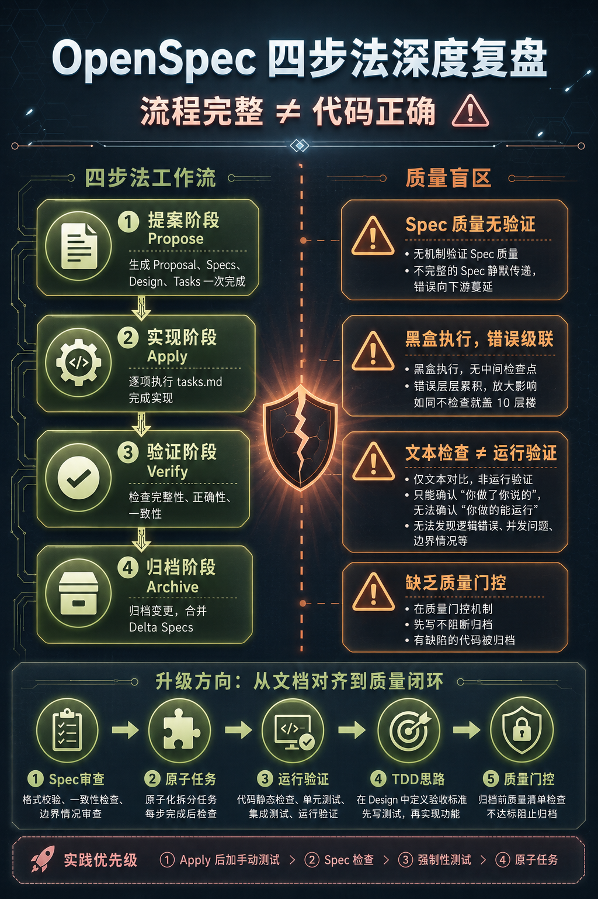
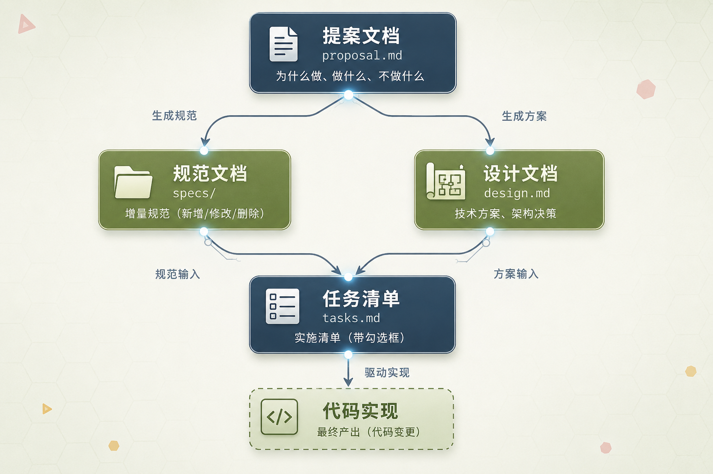
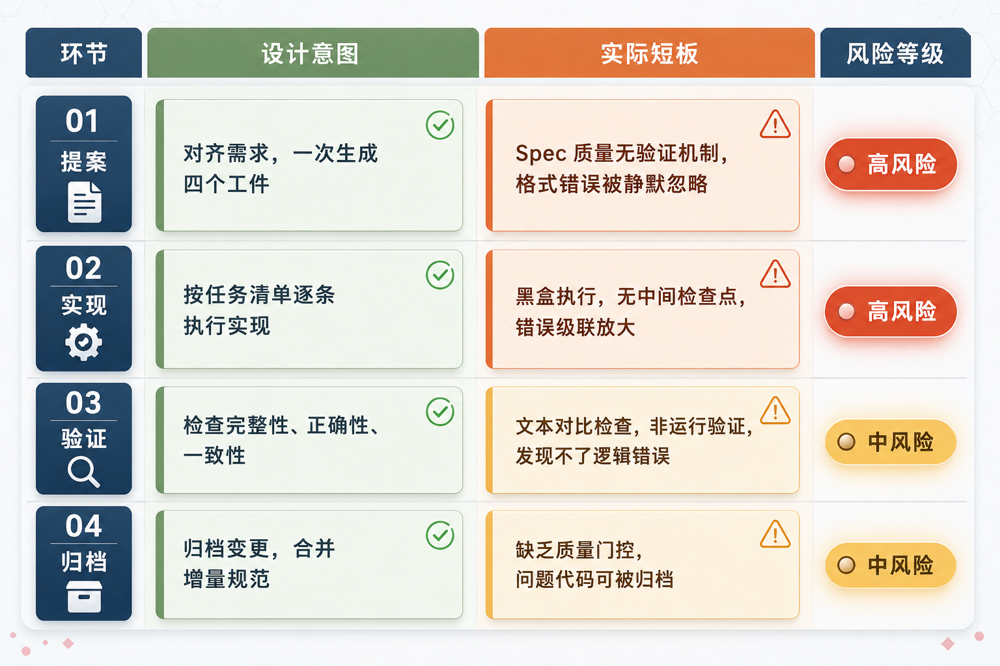
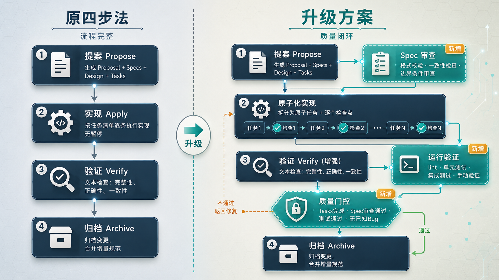

# OpenSpec 最佳实战：4 步复盘 + 5 项升级，让 AI 编程从"能跑"到"跑对"

> 🚩 2026 年「术哥无界」系列实战文档 X 篇原创计划 第 _106_ 篇，AI 编程最佳实战「2026」系列第 _31_
>
> 大家好，欢迎来到 **术哥无界 | ShugeX ｜ 运维有术**。
>
> 我是**术哥**，一名专注于 AI 编程、AI 智能体、Agent Skills、MCP、云原生、AIOps、Milvus 向量数据库的**技术实践者与开源布道者**！
>
> **Talk is cheap, let's explore。无界探索，有术而行。**



_图 1：OpenSpec 四步法复盘——流程完整 ≠ 代码正确_

> **说明**：本文是「OpenSpec 深度复盘」系列的第一篇，定位为**观点提出与问题拆解**。文中的四步法短板分析基于 OpenSpec 官方文档和过往实践记录，5 项升级方案是基于这些分析推导出的改进方向——**尚未经过完整的项目实战验证**。后续会围绕这些观点逐一落地，用实际项目跑通验证，推出 V2（单点验证）、V3（全流程验证）等实战篇。如果你有不同的看法或者已经在做类似的改进，欢迎在评论区聊聊，互相启发。

你在用 OpenSpec 的四步法工作流吗？

propose（提案）、apply（实现）、verify（验证）、archive（归档），流程走下来丝滑顺畅，每一步都有明确的输入输出，看起来靠谱得很。

但实际用下来呢？代码跑起来了没有？跑起来之后 Bug 多不多？

这是不少 OpenSpec 用户反馈的真实情况：**流程走完了，代码质量却时好时坏**。有时出来的功能直接能用，有时 Bug 频出，甚至跑不通。更让人费解的是，verify 阶段明明通过了，该检查的都检查了，运行时问题还是一个接一个。

翻了官方文档和过往的实践记录，我发现这个问题的根因不在于某个单一环节，而在于四步法的设计哲学本身：**它保证了流程完整性，但没有保证代码正确性**。

这篇文章，来做一次深度复盘。

### 1. 四步法的设计意图：它本来想做什么

拆问题之前，先回顾四步法的设计意图。

OpenSpec（GitHub: Fission-AI/OpenSpec，35K+ Star）的核心理念是**先和 AI 对齐需求，再动手写代码**。它的标准工作流（OPSX）是：

```
/opsx:propose ──► /opsx:apply ──► /opsx:verify ──► /opsx:archive
```

每个阶段都有明确的工件（Artifact）：

| | | |
| --- | --- | --- |
| Proposal | proposal.md | 为什么做、做什么、不做什么 |
| Specs | specs/ | 增量规范（ADDED/MODIFIED/REMOVED） |
| Design | design.md | 技术方案、架构决策 |
| Tasks | tasks.md | 实施清单（带复选框） |

这些工件之间有严格的依赖关系：proposal 生成 specs 和 design，specs 和 design 共同产出 tasks，tasks 驱动最终的代码实现。



_图 2：OpenSpec 四个工件的 DAG 依赖关系_

设计者的初衷很清晰：通过规范化的文档链路，让 AI 在动手之前先把需求理清楚、把方案想明白，避免**边写边想**导致的混乱。这个方向没问题。

问题在于，落地的时候每个环节都有暗坑。

### 2. 逐环节剖析：设计意图 vs 实际表现

#### Propose：Spec 质量没有验证机制

propose 一次性生成 proposal、specs、design、tasks 四个工件。高效，但藏着一个关键问题：**谁来确保这些工件本身是对的？**

根据官方文档（docs/concepts.md），Spec 是**行为契约**，写的是**系统应该做什么**。但 Spec 本身的完整性和准确性，没有验证机制。

更具体地说，Delta Specs 的格式要求很严格。比如 Scenario 必须用 `####` 四级标题，但写错了不会报错。过往实践文章的记录显示，**归档时格式不对的 Delta Spec 会被静默忽略** - 不会提示你哪里有问题，直接跳过。

这意味着什么？如果 propose 阶段的 Spec 写得不完整或有格式问题，整个后续链路都会受影响：不完整的 Spec 导致不完整的设计，不完整的设计导致不完整的任务，不完整的任务导致不完整的实现。

整个链路的质量取决于最薄弱的环节。而 propose 这个环节，恰恰没有质量兜底。

#### Apply：黑盒执行，没有中间检查点

apply 按 tasks.md 逐条实现代码。官方文档（docs/opsx.md）的描述是 `checking them off as you go`。

这里有两个问题。

**第一，没有中间检查点。** AI 从第一个 task 开始，一口气做到最后一个，中间没有停顿让你确认。如果 AI 在第 3 个 task 的实现出了问题，后面的 4、5、6 都会基于有 Bug 的代码继续构建。错误级联放大。

**第二，没有人工干预的时机设计。** 官方文档说如果发现问题可以 `fix the artifact, then continue`。但这更像一个补丁，不是系统性的解决方案。

打个比方：这就像让一个施工队一口气盖完一栋十层的楼，中间不验收任何一层。等盖完了你说第 3 层的承重墙有问题 - 对不起，第 4 到 10 层都建在上面了，改不动了。

#### Verify：文本检查不是运行验证

这是四步法中被误解最多的环节。

verify 从三个维度检查：Completeness（完整性）、Correctness（正确性）、Coherence（一致性）。听起来很严谨。

但根据官方文档（docs/commands.md）的描述，verify 检查的是**实现是否匹配 spec 意图**、**设计决策是否反映在代码中**。本质上，这是 **AI 读取文件做文本对比**，不涉及实际运行代码。

官方自己说得很直白：`verify won't block archive, but it surfaces issues`（verify 不会阻塞 archive，只是暴露问题）。

所以 verify 能发现什么？能发现**你 spec 里写了要做 A，但代码里做的是 B**这类文本层面的不一致。

发现不了什么呢？逻辑错误、竞态条件、边界情况、性能问题、安全隐患 - 这些都需要实际运行代码才能暴露。

**文本检查和运行验证是本质不同的两件事。** 前者确认**你做了你说要做的事**，后者确认**你做的事真能跑**。

#### Archive：缺乏质量门控

archive 做的是归档变更、合并 Delta Specs。质量风险相对较低，但有一个容易被忽略的问题：**archive 之前没有质量门控。**

前面说了，verify 不会阻塞 archive。也就是说，即使 verify 发现了问题，archive 照样可以执行。你可能归档了一份有问题的变更，后续的其他变更会基于这份有问题的代码继续构建。问题就这样被埋进去了。



_图 3：四步法各环节设计意图与实际短板对比_

你在用 AI 编程时遇到过类似的问题吗？比如 verify 通过了但代码跑不通，欢迎在评论区聊聊你的经验。

### 3. 根因分析：流程完整为什么产不出正确代码

把四个环节的问题放在一起看，会发现一个共同的模式。

| | | | |
| --- | --- | --- | --- |
| Propose | 对齐需求 | Spec 质量无验证 | 高 |
| Apply | 执行实现 | 黑盒执行，无中间检查 | 高 |
| Verify | 验证一致性 | 文本检查，非运行验证 | 中 |
| Archive | 归档收尾 | 缺乏质量门控 | 中 |

根本问题在于：四步法的质量保障机制是**文档层面的对齐**，不是**代码层面的验证**。

整个工作流隐含了一个假设：只要文档（Spec、Design）写得够好，AI 就能按文档实现出正确的代码。但这个假设在两个地方站不住脚。

**第一，文档本身的质量无法确保。** propose 阶段一次性生成四个工件，这些工件之间可能存在不一致，而且没有验证机制来发现这些问题。

**第二，即使文档是完美的，从文档到代码的转化也可能出错。** AI 的实现能力在复杂业务逻辑、边界条件、并发处理等方面都有局限。这不是四步法的问题，是当前 AI 编程能力的固有短板。

还有一个容易被忽视的因素：上下文窗口压力。官方 README 明确建议：`OpenSpec benefits from a clean context window. Clear your context before starting implementation`。但在 apply 过程中，AI 需要同时持有 Proposal + Specs + Design + Tasks 的信息。复杂变更产生的代码量一大，上下文窗口就会被填满，AI 在长会话中可能**遗忘**早期的设计决策，导致实现和原始设计产生偏差。


_图 4：质量风险级联传导——问题累积，越往后越难修复_

说到底，四步法解决的是**需求对齐**的问题，不是**代码质量**的问题。这是两件事，需要不同的机制来保障。

### 4. 现有改进：Apply 后加自 Review

一些用户已经意识到这个问题，并在实践中做了改进：**在 apply 结束后，让 AI 自己 review 一次代码。**

具体做法：review 没问题就 archive；有问题就修复，然后更新 change 相关文件，再 archive。

这个实践的效果如何？

能解决的问题：

- 多了一道质量关卡，能发现一些明显的逻辑错误
- 确保 tasks.md 的完成状态与实际代码一致
- 成本低，不需要额外工具

但局限也很明显：

**AI 审查自己的代码有盲区。** 让写代码和查代码的是同一个 AI，就好比让学生自己批自己的卷子 - 有些错误写的时候看不到，回头看也看不到，因为思维模式是固定的。

**没有自动化测试。** Review 仍然是文本层面的检查，不运行代码。

**Review 标准不明确。** 检查什么、怎么算通过、怎么算不通过，没有统一准则。

方向是对的，但还不够。

### 5. 升级方案：从文档对齐到质量闭环

基于上面的分析，这里梳理一个升级方案。核心思路：**在四步法基础上加入运行验证和测试闭环**，不推翻重来，而是补上缺失的环节。

#### 升级一：Propose 后加 Spec Review

**针对问题**：Spec 质量无验证，格式错误被静默忽略。

**具体做法**：

propose 生成四个工件后、apply 开始之前，加一个 Spec Review 步骤：

- **格式校验**：确保 Scenario 用了正确的标题层级（`####`），ADDED/MODIFIED/REMOVED 标记完整
- **一致性检查**：Spec 描述的行为是否覆盖了 Proposal 中的所有需求
- **边界条件审查**：是否考虑了异常场景、边界输入、错误处理

这一步的目的是在源头把控质量。不完整的 Spec 会导致整个链路下游全部偏离，修复越早成本越低。

实际操作上，可以手动检查，也可以让另一个 AI 实例来做 Review - 重点是**别让同一次 propose 的 AI 自己检查自己**。

#### 升级二：Apply 拆分为原子任务 + 检查点

**针对问题**：黑盒执行，错误级联放大。

**具体做法**：

把 apply 拆分成更小的粒度，每个原子任务完成后做一个快速检查：

```
apply-task-1 → check-1 → apply-task-2 → check-2 → ... → apply-task-N → check-N
```

每个 check 点确认三件事：

- 当前任务的代码改动是否和 task 描述一致
- 是否影响了之前已完成的 task
- 基本语法检查（lint）是否通过

这样做的好处是：错误在发生时就能被发现，而不是等所有任务做完才发现第 3 步就有问题。

如果 tasks.md 的拆分粒度太粗，可以先手动拆分：把一个大 task 拆成几个小 task，再逐个执行。OpenSpec 的工件都是 Markdown 文件，直接编辑就行。

#### 升级三：Verify 加入运行验证

**针对问题**：文本检查发现不了运行时错误。

**具体做法**：

在原有文本检查的基础上，加入实际运行验证：

1. **静态检查**：lint、类型检查（TypeScript 项目跑 `tsc --noEmit`）
2. **单元测试**：要求每个新增功能都有对应的测试用例
3. **集成测试**：涉及多个模块变更的场景，跑集成测试
4. **手动验证点**：核心业务逻辑标记需要人工确认的验证项

关键原则：**不要只看代码对不对，要看代码能不能跑**。文本检查解决**做没做**的问题，运行验证解决**能不能用**的问题。

#### 升级四：引入 TDD 思路

**针对问题**：测试被当作可选项。

**具体做法**：

把测试从**可选**变成**强制**，参考 TDD（Test-Driven Development）的思路：

1. **Design 阶段定义验收标准**：什么输入应该产生什么输出
2. **Tasks 中明确测试任务**：不是笼统的**写测试**，而是**为 XX 场景写测试，断言 YY 输出**
3. **Apply 中先写测试再写实现**：至少对核心逻辑采用这个顺序
4. **Verify 中运行测试**：测试不通过就不进入 archive

TDD 不需要严格遵循**红-绿-重构**的完整循环，但**先想清楚怎么验证，再动手写代码**这个思路，能从源头改变代码质量的保障方式。

#### 升级五：Archive 前设置质量门控

**针对问题**：Verify 不阻塞 Archive，问题代码可能被归档。

**具体做法**：

在 Archive 之前设置一个质量门控清单：

- 所有 Tasks 已完成（tasks.md 中无未勾选项）
- Spec Review 已通过
- 原子任务检查点已通过
- 运行验证已通过：lint、测试、类型检查
- 无已知未修复的 Bug

只有全部通过，才执行 Archive。这个清单可以根据项目实际情况增减条目。



_图 5：原四步法 vs 升级后工作流对比（新增环节已标注）_

### 6. 实战建议：先改什么，后改什么

上面的升级方案不需要一次性全上。以下是一个更务实的落地顺序。

#### 优先级排序

**第一步：Apply 后加 Review + 手动测试。** 成本最低，效果明显。apply 完成后先别急着 archive，让 AI review 代码，自己再手动跑一遍核心功能。

**第二步：Propose 后手动检查 Spec 质量。** 看看 Scenario 格式对不对、边界条件有没有覆盖。防止源头出错。

**第三步：在 Tasks 中强制包含测试任务。** 不是**可选的测试**，而是每个功能变更必须带测试。养成习惯。

**第四步：Apply 拆分为原子任务。** 遇到复杂变更时再用。简单变更（改两三个文件）不需要拆。

#### 利用 OpenSpec 的 Edit 机制

OpenSpec 的工件都是 Markdown 文件，可以手动编辑。

如果 propose 生成的 Spec 有问题，**直接改**，不要将就着往下走。改完后 apply 会读取修改后的版本。

如果 apply 过程中发现 tasks.md 拆分粒度太粗，也可以手动拆。工具是死的，人是活的。

#### 复杂变更分批处理

如果一个变更涉及 5 个以上文件或 3 个以上模块，考虑**拆成多个独立的 change**，每个 change 只做一件事。

好处有三：

- 每个 change 的上下文压力更小，AI 不容易**遗忘**
- 验证更集中，出问题更容易定位
- 回滚更容易，不至于一个改动出问题就把整批代码都卡住

#### 保持上下文干净

官方建议在开始 implementation 前清空上下文。这个建议要认真对待。

apply 之前执行 `/clear`，让 AI 重新读取所有工件文件。虽然会多花一点时间，但能有效避免长会话中的**遗忘**问题。

### 总结

这篇文章做了一件事：**把 OpenSpec 四步法"流程走完但代码不对"的现象拆开来看，找到每个环节的短板，并推导出 5 个升级方向**。

四步法的质量保障停留在**文档对齐**层面，缺少**代码验证**环节。Propose 阶段的 Spec 没有质量验证，Apply 是黑盒执行，Verify 做的是文本检查而非运行验证，Archive 缺乏质量门控。单独看每个问题都不大，叠加起来就是**流程走完了但代码不对**的尴尬局面。

但坦率说，这篇文章只完成了**发现问题**和**提出方案**这两步。提出的 5 个升级方向——Spec Review、原子任务拆分、运行验证、TDD 思路、质量门控——逻辑上说得通，但**还没有用真实项目验证过**。这些方案到底能不能跑通？哪几个效果最明显？落地时又会踩什么新坑？这些问题的答案，要靠实战才能给出来。

这也是为什么把这篇文章作为「OpenSpec 深度复盘」系列的第一篇——**先抛出观点，后续逐一实战验证**。如果你也在用 OpenSpec，你的工作流是什么样的？有没有遇到过类似的问题？评论区聊聊，互相启发。

**好啦，谢谢你观看我的文章，如果喜欢可以点赞转发给需要的朋友，我们下一期再见！敬请期待！**

来源：https://cloud.tencent.com/developer/article/2666759
