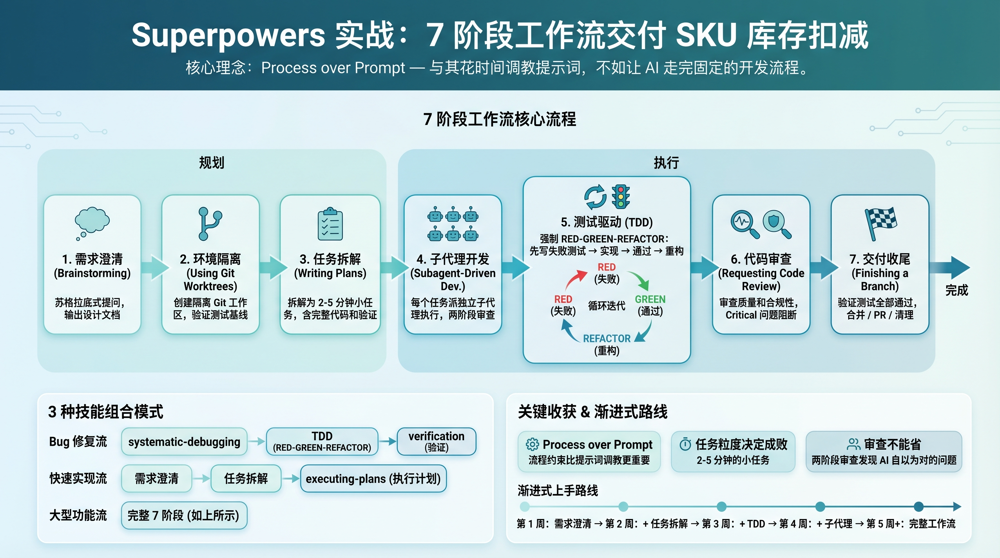
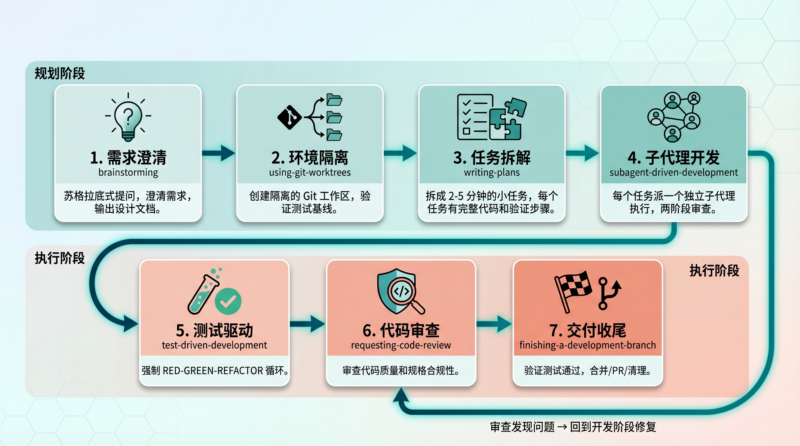
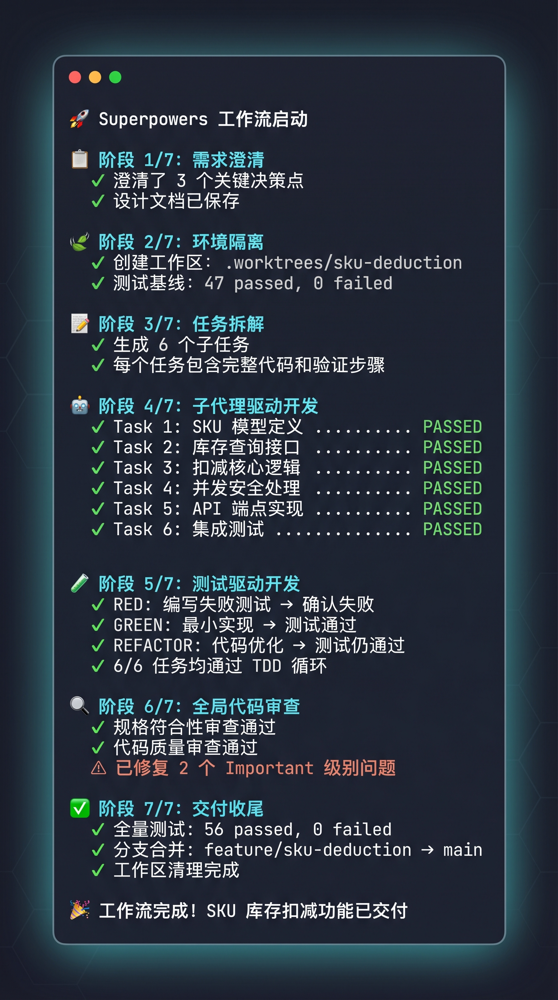
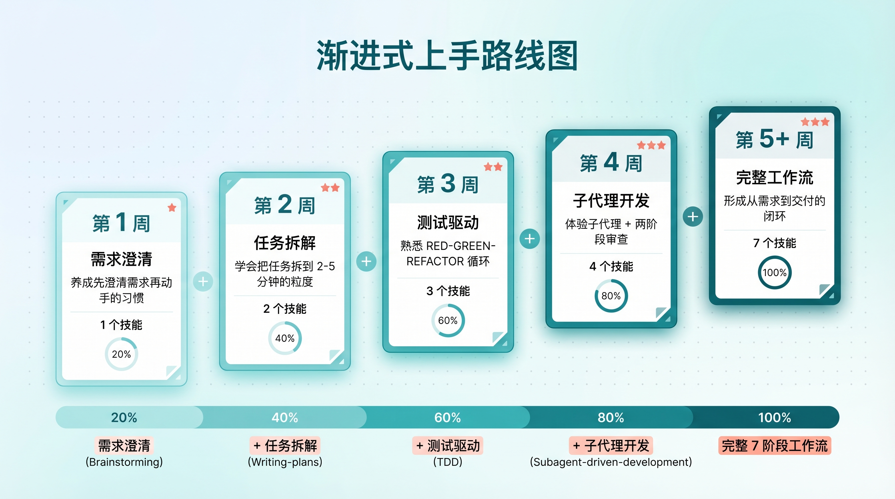

# Superpowers 最佳实战：7 阶段工作流交付电商系统 SKU 商品库存扣减逻辑

> 🚩 2026 年「术哥无界」系列实战文档 X 篇原创计划 第 _82_ 篇，AI 编程最佳实战「2026」系列第 _16_ 篇
>
> 大家好，欢迎来到 __术哥无界 | ShugeX ｜ 运维有术__。
>
> 我是__术哥__，一名专注于 AI 编程、AI 智能体、Agent Skills、MCP、云原生、AIOps、Milvus 向量数据库的__技术实践者与开源布道者__！
>
> __Talk is cheap, let's explore。无界探索，有术而行。__



封面图

_图 1：Superpowers 7 阶段工作流全景信息图_

用 AI 编程工具写代码，很多人遇到的是同一个问题：__AI 跳步、不写测试、声称完成但实际没验证__。Superpowers 的解法很直接 - 用一套结构化的工程流程把 AI 的行为约束住。它的核心理念叫 Process over Prompt：与其花时间调教提示词，不如让 AI 走完固定的开发流程。

今天用一个电商系统中常见的__带 SKU 的商品库存扣减__场景，完整走一遍 Superpowers 的 7 个阶段工作流。技术栈选 Python（FastAPI + SQLAlchemy），每一步都会给出具体的命令、代码和 AI 交互过程。

### 一、Superpowers 7 阶段工作流全景



7阶段工作流全景流程图

_图 2：Superpowers 7 阶段工作流全景流程图_

Superpowers 把一个完整的开发任务拆成 7 个阶段，每个阶段对应一个独立的技能（Skill），按顺序自动触发：

|  |  |  |
| --- | --- | --- |
| 1 | `brainstorming` | 苏格拉底式提问，澄清需求，输出设计文档 |
| 2 | `using-git-worktrees` | 创建隔离的 Git 工作区，验证测试基线 |
| 3 | `writing-plans` | 把工作拆成 2-5 分钟的小任务，每个任务有完整代码和验证步骤 |
| 4 | `subagent-driven-development` | 每个任务派一个独立子代理执行，两阶段审查 |
| 5 | `test-driven-development` | 强制 RED-GREEN-REFACTOR：先写失败测试 → 实现 → 通过 → 重构 |
| 6 | `requesting-code-review` | 审查代码质量和规格合规性，Critical 问题阻断进度 |
| 7 | `finishing-a-development-branch` | 验证测试全部通过，合并 / PR / 清理 |

一个关键点：这些技能__不是建议，是强制规则__。只要 AI 检测到某个技能适用，就必须调用它，没有跳过的选项。

### 二、实战案例背景：SKU 库存扣减

电商系统里有一个绕不开的场景：用户下单后，需要根据选定的商品规格（颜色、尺码等）扣减对应的 SKU 库存。这个场景的核心难点有三个：

- __库存校验__：扣减前要检查库存是否充足
- __原子性扣减__：高并发下不能超卖，需要行级锁或乐观锁
- __边界条件__：库存为零、SKU 不存在、重复扣减等情况都要处理

技术栈：Python 3.11 + FastAPI + SQLAlchemy 2.0 + Pytest。

下面按 Superpowers 的 7 个阶段，逐步完成这个功能。

### 三、阶段 1：brainstorming - 需求澄清

进入 Claude Code 会话后，直接描述你要做什么。Superpowers 的 `brainstorming` 技能会自动触发，它__不会急着写代码__，而是通过一次一个问题来帮你理清需求。

#### 交互过程

```
你：我需要为电商系统实现 SKU 库存扣减功能，用户下单时
    根据选定的商品规格扣减对应 SKU 的库存。

AI：这个需求涉及几个关键决策点。先问第一个：
    库存扣减需要支持并发下单吗？也就是说，
    同一个 SKU 可能同时被多个用户购买？

你：是的，需要处理并发。

AI：并发场景下有两种常见方案：
    A. 悲观锁 - SELECT ... FOR UPDATE，简单直接但吞吐量低
    B. 乐观锁 - 版本号控制，吞吐量高但需要处理冲突重试

    根据你的场景（电商下单），我推荐方案 A（悲观锁），
    原因是：实现简单，且库存扣减的冲突概率不高，
    悲观锁的锁等待开销可接受。你觉得呢？

你：用悲观锁。

AI：下一个问题：扣减失败时（库存不足），
    需要返回什么级别的错误信息？
    A. 简单提示"库存不足"
    B. 详细信息（包含当前可用库存数量）

你：方案 B，需要告诉用户当前还有多少库存。

AI：最后一个问题：是否需要支持部分扣减？
    比如：用户买 5 件但只有 3 件库存，
    是扣 3 件还是全部失败？

你：全部失败，不允许部分扣减。
```

brainstorming 结束后，AI 会把确认的设计方案写成文档并提交：

```
# 自动保存的设计文档路径
docs/superpowers/specs/2026-04-12-sku-inventory-deduction-design.md
```

#### 实战技巧

brainstorming 阶段的核心价值在于__强制你把模糊的想法变成明确的规格__。 Jesse Vincent 在博客里提到过一个原则：设计文档要详细到__一个刚入职、经验不多、不喜欢写测试的初级工程师__都能按照它完成实现。这听起来有点夸张，但后面的计划阶段就是按这个标准来写的。

### 四、阶段 2：using-git-worktrees - 隔离开发环境

设计文档通过后，Superpowers 自动创建一个隔离的 Git 工作区，避免在主分支上做实验。

#### 命令演示

```
AI：我正在使用 using-git-worktrees 技能创建隔离工作区。

    [检查 .worktrees/ 目录 - 已存在]
    [验证 .worktrees/ 已被 gitignore - 确认]
    [创建工作区]

$ git worktree add .worktrees/sku-deduction -b feature/sku-deduction
准备工作区检出（分离的 HEAD 4a8f2c1）
更新文件: 127, 完成。

$ cd .worktrees/sku-deduction
$ pip install -r requirements.txt
安装完成: 42 个包

$ pytest tests/ -v
================== 47 passed, 0 failed ==================

工作区已就绪: .worktrees/sku-deduction
测试基线: 47 个测试通过, 0 个失败
准备实现 SKU 库存扣减功能
```

这一步做三件事：创建独立分支、安装依赖、跑一遍测试确保基线是干净的。如果基线测试就有失败，Superpowers 会停下来让你决定是先修复还是继续。

### 五、阶段 3：writing-plans - 任务拆解

这个阶段是 Superpowers 的精华之一。AI 会把整个功能拆成一组__粒度极细的任务__，每个任务 2-5 分钟就能完成，包含完整的代码和验证命令。

__生成的计划片段__

#### Task 1: SKU 模型定义

__Files:__

- Create: `app/models/sku.py`
- Test: `tests/test_sku_model.py`

__Step 1: 写失败测试__

```
# tests/test_sku_model.py
from app.models.sku import SKU

def test_sku_creation():
    sku = SKU(
        product_id=1,
        specs={"color": "black", "size": "M"},
        stock=100
    )
    assert sku.stock == 100
    assert sku.specs == {"color": "black", "size": "M"}
```

__Step 2: 运行测试，确认失败__

```
$ pytest tests/test_sku_model.py -v
FAILED - ModuleNotFoundError: No module named 'app.models.sku'
```

__Step 3: 实现最小代码__

```
# app/models/sku.py
from sqlalchemy import Column, Integer, JSON, ForeignKey
from sqlalchemy.orm import relationship
from app.database import Base

class SKU(Base):
    __tablename__ = "skus"

    id = Column(Integer, primary_key=True, index=True)
    product_id = Column(Integer, ForeignKey("products.id"), nullable=False)
    specs = Column(JSON, nullable=False)
    stock = Column(Integer, nullable=False, default=0)

    product = relationship("Product", back_populates="skus")
```

__Step 4: 运行测试，确认通过__

```
$ pytest tests/test_sku_model.py -v
PASSED
```

__Step 5: 提交__

```
$ git add app/models/sku.py tests/test_sku_model.py
$ git commit -m "feat: add SKU model with specs and stock"
```

注意这个粒度：__写测试是一个步骤，运行确认失败是另一个步骤__。Superpowers 不允许把多步合并成一步，因为每一步的输出都需要验证。

#### 任务拆解的核心原则

Jesse Vincent 对计划的要求是：__不允许出现 TBD、TODO、`添加适当的错误处理`这类模糊描述__。每个步骤必须有实际代码、确切文件路径、具体的验证命令。如果计划里出现了占位符，那就是计划本身的 bug，必须修。

### 六、阶段 4：subagent-driven-development - 子代理驱动开发

计划就绪后，Superpowers 进入执行阶段。这里有两个选项：

- __subagent-driven-development__（推荐）：每个任务派一个独立子代理，两阶段审查
- __executing-plans__：在当前会话里按批次执行

下面展示 subagent 模式。核心机制是：__每个任务一个干净的子代理，完成后自动触发两阶段审查__。

#### 子代理派遣过程

```
AI：我正在使用 Subagent-Driven Development 执行计划。

[读取计划文件: docs/superpowers/plans/sku-inventory.md]
[提取全部 6 个任务的完整文本和上下文]
[创建 TodoWrite 跟踪所有任务]

---

Task 1: SKU 模型定义
[派遣实现子代理 - 提供完整任务文本 + 项目上下文]

实现子代理:
  - 使用 TDD 实现（先写测试，再写代码）
  - 5/5 测试通过
  - 自查: 未发现问题
  - 已提交 (a7981ec)

[派遣规格审查子代理]
规格审查子代理: ✅ 规格符合 - 所有需求已实现，无多余内容

[派遣代码质量审查子代理]
质量审查子代理:
  优点: 干净的模型定义，测试充分
  问题: 无
  评估: ✅ 通过

[标记 Task 1 完成]

---

Task 2: 库存扣减核心逻辑
[派遣实现子代理]

实现子代理:
  - 使用 TDD 实现
  - 2/2 测试通过
  - 自查: 发现缺少边界检查，已补充
  - 已提交 (3df7661)

[派遣规格审查子代理]
规格审查子代理:
  ❌ 发现问题:
  - 缺失: SKU 不存在时未处理（规格要求返回 404）
  - 多余: 添加了 InsufficientStockError 类，
    但规格里只要求 ValueError

[实现子代理修复]
  - 添加 SKU 不存在的处理逻辑
  - 将 InsufficientStockError 改为 ValueError 的子类

[规格审查子代理复审]
规格审查子代理: ✅ 规格符合

[派遣代码质量审查子代理]
质量审查子代理:
  ✅ 优点: 悲观锁使用正确，测试覆盖正常和异常路径
  ⚠️ 建议: deduct 方法缺少数量 ≤ 0 的边界检查
  评估: 修复后可通过

[实现子代理修复]
  添加数量校验: quantity <= 0 时抛出 ValueError

[代码质量审查子代理复审]
质量审查子代理: ✅ 通过

[标记 Task 3 完成]

... 后续任务类似流程 ...
```

#### 两阶段审查机制详解

每个任务完成后，subagent-driven-development 会自动触发两轮审查。这两轮审查的职责完全不同：

__第一轮：规格符合性审查（spec reviewer）__

检查代码实现是否与设计文档一致。关注两类问题：

- __缺失__：规格要求的功能没实现
- __多余__：实现了规格中没有要求的东西

这一轮确保子代理__严格按照设计文档实现，不多不少__。

__第二轮：代码质量审查（code quality reviewer）__

在规格审查通过后，检查代码本身的质量。关注：

- 代码风格、命名、结构
- 边界条件处理
- 性能问题
- 测试质量

这一轮确保子代理__不仅做对了事，而且把事做对了__。

两轮审查必须__按顺序执行__：先确认规格没问题，再审查代码质量。规格审查发现问题 → 子代理修复 → 规格复审通过 → 才进入质量审查。不允许跳过或调换顺序。

### 七、阶段 5：test-driven-development - 测试驱动开发

上面的子代理在实现每个任务时，遵循的就是 TDD 流程。Superpowers 对 TDD 的态度极其严格：__没有看到测试失败，就不能写生产代码。先写了代码再补测试？删掉重来。__

以 Task 2（库存扣减核心逻辑）为例，展示子代理内部的 RED-GREEN-REFACTOR 过程。

#### RED - 写失败测试

```
# tests/test_inventory_service.py
import pytest
from app.services.inventory import InventoryService

def test_deduct_stock_success(db_session):
    """测试正常扣减"""
    sku = create_test_sku(db_session, stock=100)
    service = InventoryService(db_session)
    service.deduct(sku.id, quantity=3)

    db_session.refresh(sku)
    assert sku.stock == 97

def test_deduct_stock_insufficient(db_session):
    """测试库存不足"""
    sku = create_test_sku(db_session, stock=5)
    service = InventoryService(db_session)

    with pytest.raises(ValueError, match="库存不足"):
        service.deduct(sku.id, quantity=10)
```

运行测试，__必须看到失败__：

```
$ pytest tests/test_inventory_service.py -v
FAILED - ModuleNotFoundError: No module named 'app.services.inventory'
```

测试失败了？好。这说明测试确实在检测一个__还不存在的功能__。如果测试一开始就通过了，那说明测试写错了，或者功能已经存在了。

#### GREEN - 写最小实现

```
# app/services/inventory.py
from sqlalchemy.orm import Session
from sqlalchemy import select
from app.models.sku import SKU

class InsufficientStockError(ValueError):
    def __init__(self, sku_id: int, requested: int, available: int):
        self.sku_id = sku_id
        self.requested = requested
        self.available = available
        super().__init__(
            f"库存不足: 需要 {requested}，当前库存 {available}"
        )

class InventoryService:
    def __init__(self, session: Session):
        self.session = session

    def deduct(self, sku_id: int, quantity: int) -> None:
        stmt = (
            select(SKU)
            .where(SKU.id == sku_id)
            .with_for_update()  # 悲观锁
        )
        sku = self.session.execute(stmt).scalar_one()

        if sku.stock < quantity:
            raise InsufficientStockError(
                sku_id, quantity, sku.stock
            )

        sku.stock -= quantity
        self.session.commit()
```

注意：只写__让测试通过的最小代码__。不要加额外的功能、不要做优化、不要重构。那些是 REFACTOR 阶段的事。

运行测试：

```
$ pytest tests/test_inventory_service.py -v
test_deduct_stock_success PASSED
test_deduct_stock_insufficient PASSED
================== 2 passed ==================
```

测试通过了，可以提交了。这就是一个完整的 RED-GREEN 循环。后续的子任务会重复这个流程，每次只加一个测试、写最小实现、确认通过。

你在项目中用过类似的并发库存方案吗？是悲观锁还是乐观锁？欢迎在评论区聊聊。

### 八、阶段 6：requesting-code-review - 全局代码审查

所有任务完成后，Superpowers 会做一次__全局代码审查__。和阶段 4 中每个任务的逐项审查不同，这次审查关注的是__整体质量__。

#### 审查结果示例

```
代码审查子代理:

✅ 优点:
  - 测试覆盖率高，正常路径和异常路径都有测试
  - 悲观锁实现正确，避免了并发超卖
  - 错误信息包含具体数值，便于前端展示

⚠️ Important 级别问题:
  1. deduct() 方法没有处理 db_session.commit() 失败的情况
     建议: 添加 try/except + rollback
  2. 批量扣减场景下，多次 WITH FOR UPDATE 可能导致
     锁等待时间过长
     建议: 按 sku_id 排序后再加锁，避免死锁

ℹ️ Minor 级别建议:
  - SKU 模型的 specs 字段可以考虑添加 JSON Schema 校验
  - InventoryService 可以添加日志记录扣减操作

评估: 修复 Important 问题后可合并
```

修复后的关键代码片段：

```
# app/services/inventory.py - 修复版
class InventoryService:
    def __init__(self, session: Session):
        self.session = session

    def deduct(self, sku_id: int, quantity: int) -> None:
        if quantity <= 0:
            raise ValueError("扣减数量必须大于 0")

        try:
            stmt = (
                select(SKU)
                .where(SKU.id == sku_id)
                .with_for_update()
            )
            sku = self.session.execute(stmt).scalar_one()

            if sku.stock < quantity:
                raise InsufficientStockError(
                    sku_id, quantity, sku.stock
                )

            sku.stock -= quantity
            self.session.commit()
        except NoResultFound:
            raise ValueError(f"SKU {sku_id} 不存在")
        except Exception:
            self.session.rollback()
            raise

    def batch_deduct(
        self, items: list[tuple[int, int]]
    ) -> None:
        """批量扣减，按 sku_id 排序避免死锁"""
        sorted_items = sorted(items, key=lambda x: x[0])
        for sku_id, quantity in sorted_items:
            self.deduct(sku_id, quantity)
```

### 九、阶段 7：finishing-a-development-branch - 交付收尾

代码审查通过后，Superpowers 进入收尾阶段。

#### 验证和合并

```
AI：正在使用 finishing-a-development-branch 技能完成交付。

$ pytest tests/ -v
================== 56 passed, 0 failed ==================
（基线 47 个 + 新增 9 个测试，全部通过）

实现已完成。你希望怎么处理？

1. 合并回 main 分支
2. 推送并创建 Pull Request
3. 保留分支（稍后自己处理）
4. 丢弃这个工作

请选择:
```

选择合并后的操作：

```
$ git checkout main
$ git pull
$ git merge feature/sku-deduction
$ pytest tests/ -v
================== 56 passed, 0 failed ==================

# 合并后测试仍然通过，清理工作区
$ git worktree remove .worktrees/sku-deduction
```

整个流程到这里就结束了。从需求澄清到代码合并，全程有测试保护、有审查关卡。



终端输出示意图

_图 3：Superpowers 完整 7 阶段工作流终端输出过程_

### 十、高级技巧：3 种技能组合模式

掌握了基本工作流后，可以根据场景组合不同的技能。

#### 模式一：Bug 修复流

```
systematic-debugging → test-driven-development
→ verification-before-completion
```

碰到 Bug 时，不要直接改代码。先用 `systematic-debugging` 四阶段法定位根因：读错误信息 → 稳定复现 → 检查最近变更 → 追踪数据流。找到根因后，用 TDD 写一个能复现 Bug 的测试（RED），再修复（GREEN），最后用 `verification-before-completion` 确认真的修好了。

#### 模式二：快速实现流

```
brainstorming → writing-plans → executing-plans
```

不需要子代理的简单场景，用 `executing-plans` 代替 `subagent-driven-development`。区别是 executing-plans 在当前会话里按批次执行，每 3 个任务停下来让你检查一次。适合改动范围小、任务之间有依赖的情况。

#### 模式三：大型功能流

```
brainstorming → writing-plans
→ subagent-driven-development
→ requesting-code-review
→ finishing-a-development-branch
```

这就是本文演示的完整流程，适合大型功能开发。关键变量是 `subagent-driven-development`：每个任务一个干净上下文的子代理，避免任务之间的上下文污染。Jesse Vincent 在 README 里提到，Claude 在这种模式下可以__自主工作数小时不偏离计划__。

### 十一、渐进式上手路线图

不建议一开始就把 7 个阶段全用上。根据社区反馈和官方推荐，分阶段上手更合理：

|  |  |  |  |
| --- | --- | --- | --- |
| 第 1 周 | `brainstorming` | 养成先澄清需求再动手的习惯 | 做 2-3 次小需求 |
| 第 2 周 | - `writing-plans` | 学会把任务拆到 2-5 分钟的粒度 | 做 1 次中等功能 |
| 第 3 周 | - `test-driven-development` | 熟悉 RED-GREEN-REFACTOR 循环 | 配合前面的计划做 |
| 第 4 周 | - `subagent-driven-development` | 体验子代理 + 两阶段审查 | 做一次完整功能 |
| 第 5 周+ | 完整 7 阶段工作流 | 形成从需求到交付的闭环 | 根据项目节奏推进 |

每个阶段只加一个新的技能，压力小很多。前三周甚至不需要安装 Superpowers，手动模拟这些流程也能帮你建立工程思维。



渐进式学习路线图

_图 4：5 周渐进式上手路线图_

### 总结

Superpowers 的核心价值不在工具本身，在于它灌输的工程纪律：__先想清楚再动手，先写测试再写代码，先审查再交付__。

三个关键收获：

- __Process over Prompt__：与其花时间调教提示词，不如让 AI 走固定的工程流程。同样的模型，有流程约束和没有流程约束，产出质量的差距非常大
- __任务粒度决定成败__：把一个大功能拆成 2-5 分钟的小任务，每个任务有完整代码和验证步骤，这本身就是很好的设计过程
- __审查不能省__：子代理的两阶段审查（规格符合性 + 代码质量）能发现很多 __AI 觉得自己做对了__ 的问题

建议收藏这篇文章，下次用 Superpowers 做项目时翻出来对照着走一遍。如果你的同事也在用 AI 编程工具，转发给他们看看这个工作流。

__官方仓库__：https://github.com/obra/superpowers

__作者博客__：https://blog.fsck.com/2025/10/09/superpowers/

__快速上手指南__：https://lzw.me/docs/opencodedocs/zh/obra/superpowers/start/quick-start/

__好啦，谢谢你观看我的文章，如果喜欢可以点赞转发给需要的朋友，我们下一期再见！敬请期待！__

来源：https://cloud.tencent.com/developer/article/2658944
