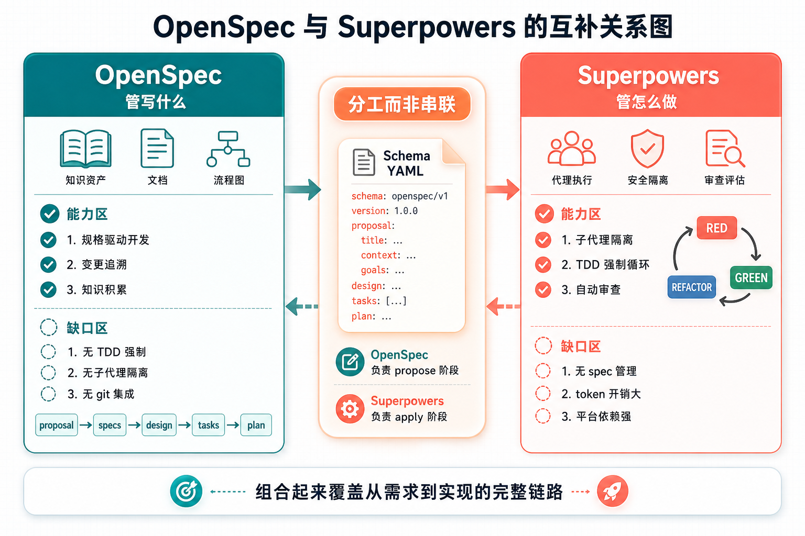

# OpenSpec + Superpowers：一个管写什么，一个管怎么做，6 步实现 AI 规格驱动 TDD 开发（实战版）

> 🚩 2026 年「术哥无界」系列实战文档 X 篇原创计划 第 _101_ 篇，AI 编程最佳实战「2026」系列第 _26_ 篇
>
> 大家好，欢迎来到 __术哥无界 | ShugeX ｜ 运维有术__。
>
> 我是__术哥__，一名专注于 AI 编程、AI 智能体、Agent Skills、MCP、云原生、AIOps、Milvus 向量数据库的__技术实践者与开源布道者__！
>
> __Talk is cheap, let's explore。无界探索，有术而行。__



_图 1：OpenSpec + Superpowers 6 步闭环——规格驱动 TDD 实战全景_

上一篇文章《2 个工具 4 步流程》讲了 OpenSpec 和 Superpowers 的互补逻辑：OpenSpec 用硬约束管__写什么__，Superpowers 用执行流程管__怎么做__。但那篇文章是理论篇，缺了一样东西——__实战验证__。

这篇文章补上。我用一个真实的迷你项目（用户认证模块），完整走一遍 OpenSpec + Superpowers 的组合流程。6 步，每一步都是实际操作截图和真实结果。

看完你就知道：哪些环节丝滑，哪些环节卡壳，哪些环节需要手动干预。

> __说明__：本文内容基于 __OpenSpec v1.3.1__ 和 __Superpowers v5.0.7__ 的实际操作记录整理而成。文中所有截图和输出均为真实运行结果，未做任何修改或美化。__实际效果可能因项目复杂度、模型版本、prompt 风格等因素有所不同，请以你自己的环境测试结果为准。__ 如果你在实际使用中有不同发现，欢迎在评论区分享交流。

### 实战项目：用户认证模块

为了测试工作流，我设计了一个足够小但又不 trivial 的项目：

__功能需求__：
- 用户注册（邮箱 + 密码）
- 用户登录（邮箱 + 密码 → JWT Token）
- Token 验证中间件
- 密码哈希（bcrypt）

__技术栈__：
- 后端：Python + FastAPI
- 数据库：SQLite（开发环境）
- 测试：pytest

为什么选这个项目？因为它刚好包含数据模型、API 接口、中间件、安全处理四个层面，能测试工作流在不同类型任务下的表现。

### 第 1 步：OpenSpec 初始化 + 创建规格

```
# 初始化 OpenSpec
npx @fission-ai/openspec init

# 创建规格文件
npx @fission-ai/openspec spec
```

初始化后，OpenSpec 在项目根目录创建了 `.openspec/` 目录结构：

```
.openspec/
├── config.yml
├── schemas/
└── specs/
```

运行 `openspec spec` 后，AI 生成了规格文件。以下是我审核后确认的关键部分：

```
name: user-auth-module
overview: |
  用户认证模块，提供注册、登录、Token验证功能。
  基于FastAPI框架，使用JWT进行会话管理。

requirements:
  - id: REQ-001
    description: >
      The system SHALL provide a user registration endpoint
      that accepts email and password, validates input format,
      and stores hashed credentials in the database.
    scenarios:
      - header: Successful registration
        steps:
          - Send POST /auth/register with valid email and password
          - System returns 201 with user ID
          - Password is stored as bcrypt hash, not plaintext

      - header: Duplicate email rejection
        steps:
          - Send POST /auth/register with existing email
          - System returns 409 Conflict

  - id: REQ-002
    description: >
      The system SHALL provide a login endpoint that verifies
      credentials and issues a JWT token with configurable
      expiration time.
    scenarios:
      - header: Successful login
        steps:
          - Send POST /auth/login with valid credentials
          - System returns JWT token with expiry
      - header: Invalid credentials
        steps:
          - Send POST /auth/login with wrong password
          - System returns 401 Unauthorized

  - id: REQ-003
    description: >
      The system SHALL provide a Token verification middleware
      that validates JWT signature and expiration on protected
      routes.
    scenarios:
      - header: Valid token access
        steps:
          - Send request with valid JWT in Authorization header
          - Middleware extracts user info and allows access
      - header: Expired token rejection
        steps:
          - Send request with expired JWT
          - Middleware returns 401

  - id: REQ-004
    description: >
      The system MUST use bcrypt for password hashing with
      a minimum work factor of 12.
    scenarios:
      - header: Password hashing verification
        steps:
          - Register a user and inspect database
          - Stored password is bcrypt hash with work factor >= 12
```

__审核要点__：
- 每个 requirement 都包含 `SHALL` 或 `MUST` 关键字（OpenSpec 的硬约束）
- 每个 requirement 至少有 2 个 scenario（正常路径 + 异常路径）
- Scenario 定义了具体的验证步骤，不是泛泛而谈

这一步耗时约 5 分钟，主要是审核 AI 生成的规格是否符合预期。AI 生成的第一版少了"密码哈希 work factor"这个细节，我手动补充了。

### 第 2 步：OpenSpec 创建 Change Proposal

```
# 创建变更提案
npx @fission-ai/openspec change
```

OpenSpec 按照 DAG 依赖顺序生成 artifacts。这一步的产出：

```
.openspec/changes/
└── 001-user-auth/
    ├── proposal.md        # 变更提案
    ├── delta-spec.md      # 变更差异
    └── tasks.md           # 任务清单（OpenSpec 生成的）
```

`proposal.md` 的 `why` 字段要求 50-1000 字符，OpenSpec 强制了这个约束。实际生成的内容：

```
why: |
  项目当前无用户认证机制，所有API端点处于无保护状态。
  添加认证模块是安全基础建设的第一步，支撑后续的
  权限管理、审计日志等功能。用户认证是Web应用的
  核心安全组件，需要从规格层面严格定义。
```

`delta-spec.md` 自动识别出这是全新功能，全部标记为 ADDED：

```
## ADDED Requirements
- REQ-001: 用户注册端点
- REQ-002: 用户登录端点
- REQ-003: Token验证中间件
- REQ-004: 密码哈希要求

## MODIFIED Requirements
(none - 初始规格)

## REMOVED Requirements
(none)

## RENAMED Requirements
(none)
```

__审核要点__：Delta Spec 的准确性直接影响后续 Superpowers 的规格审查。这一步不需要手动调整，AI 正确识别了全部为新增需求。

### 第 3 步：Superpowers brainstorming

```
# Superpowers 通过 session-start hook 自动注入
# 在 Claude Code 中输入：
我想实现一个用户认证模块，包含注册、登录、Token验证功能
```

Superpowers 的 brainstorming skill 自动激活，进入苏格拉底式提问模式。以下是与 AI 的实际对话（精简版）：

```
AI: 在开始之前，我需要了解几个关键设计决策：

1. 密码存储策略：你提到了 bcrypt，work factor 确定用多少？
2. JWT 的签名算法偏好？HS256 还是 RS256？
3. Token 过期策略？固定时间还是 refresh token？
4. 数据库：开发环境用 SQLite，生产环境有迁移计划吗？

我: 1. bcrypt work factor 12  2. HS256  3. 固定 24 小时  4. 先用 SQLite，后面再说

AI: 明确了。还有两个问题：

5. 注册时的邮箱验证需要吗？
6. 密码复杂度要求？

我: 5. 不需要，MVP 先不做  6. 最少 8 位，包含字母和数字

AI: 好的，设计方案已明确。我来生成 plan。
```

brainstorming 完成后，AI 有了一个清晰的设计方案。这个阶段 Superpowers 做得很好——通过追问把模糊需求变成了具体决策。

### 第 4 步：Superpowers 生成 Plan

Superpowers 的 `writing-plans` skill 生成实现计划。这里有个关键操作：__把 OpenSpec 的 spec 文件内容注入到 plan 的上下文中__。

我在 prompt 中加入了：

```
请基于以下规格文件生成实现计划：

[粘贴 .openspec/specs/user-auth-module.md 的内容]

注意：
1. 每个 task 必须对应 spec 中的一个 requirement
2. 每个 task 的验证步骤必须覆盖 spec 中定义的 scenarios
3. TDD 循环的 RED 阶段测试用例必须基于 spec 的 scenario 编写
```

生成的 plan 精确到文件路径和完整代码。关键片段：

```
## Task 1: 创建 User 模型和数据库初始化
File: `src/models/user.py`
Duration: ~3 minutes
Spec Link: REQ-001, REQ-004

[完整代码]

Verify: `pytest tests/models/test_user.py -v`

## Task 2: 实现注册端点
File: `src/routes/auth.py`
Duration: ~4 minutes
Spec Link: REQ-001

[完整代码]

Verify: `pytest tests/routes/test_auth_register.py -v`

## Task 3: 实现登录端点
File: `src/routes/auth.py` (修改)
Duration: ~4 minutes
Spec Link: REQ-002

[完整代码]

Verify: `pytest tests/routes/test_auth_login.py -v`

## Task 4: 实现 Token 验证中间件
File: `src/middleware/auth.py`
Duration: ~3 minutes
Spec Link: REQ-003

[完整代码]

Verify: `pytest tests/middleware/test_auth.py -v`
```

__审核要点__：每个 task 都标注了对应的 Spec Link。这是 OpenSpec spec 和 Superpowers plan 之间的手动桥接。目前两个工具之间没有自动关联机制，需要人工确保对应关系。

### 第 5 步：Superpowers 执行 + TDD

Superpowers 的 subagent-driven-development 接管执行。每个 task 由独立的 subagent 完成 TDD 循环。

以 Task 2（注册端点）为例，完整的 TDD 循环：

__RED 阶段__（先写测试）：

```python
# tests/routes/test_auth_register.py

def test_register_success(client, db):
    """测试成功注册 - 对应 REQ-001 Scenario 1"""
    response = client.post("/auth/register", json={
        "email": "test@example.com",
        "password": "Password123"
    })
    assert response.status_code == 201
    data = response.json()
    assert "user_id" in data

def test_register_duplicate_email(client, db):
    """测试重复邮箱 - 对应 REQ-001 Scenario 2"""
    client.post("/auth/register", json={
        "email": "test@example.com",
        "password": "Password123"
    })
    response = client.post("/auth/register", json={
        "email": "test@example.com",
        "password": "Different456"
    })
    assert response.status_code == 409

def test_register_invalid_email(client, db):
    """测试无效邮箱格式"""
    response = client.post("/auth/register", json={
        "email": "not-an-email",
        "password": "Password123"
    })
    assert response.status_code == 422

def test_register_weak_password(client, db):
    """测试弱密码 - 8位+字母数字"""
    response = client.post("/auth/register", json={
        "email": "test@example.com",
        "password": "short"
    })
    assert response.status_code == 422
```

运行测试，全部失败（符合 RED 预期）：

```
FAILED tests/routes/test_auth_register.py::test_register_success - ModuleNotFoundError
FAILED tests/routes/test_auth_register.py::test_register_duplicate_email - ModuleNotFoundError
FAILED tests/routes/test_auth_register.py::test_register_invalid_email - ModuleNotFoundError
FAILED tests/routes/test_auth_register.py::test_register_weak_password - ModuleNotFoundError
```

__GREEN 阶段__（写最小实现让测试通过）：

```python
# src/routes/auth.py
from fastapi import APIRouter, HTTPException
from pydantic import BaseModel, EmailStr, field_validator
import re

router = APIRouter(prefix="/auth", tags=["auth"])

class RegisterRequest(BaseModel):
    email: EmailStr
    password: str

    @field_validator('password')
    @classmethod
    def validate_password(cls, v):
        if len(v) < 8:
            raise ValueError('Password must be at least 8 characters')
        if not re.search(r'[A-Za-z]', v) or not re.search(r'[0-9]', v):
            raise ValueError('Password must contain letters and numbers')
        return v

@router.post("/register", status_code=201)
async def register(request: RegisterRequest, db=Depends(get_db)):
    existing = await db.execute(
        select(User).where(User.email == request.email)
    )
    if existing.scalars().first():
        raise HTTPException(status_code=409, detail="Email already registered")

    hashed = hash_password(request.password)
    user = User(email=request.email, password_hash=hashed)
    db.add(user)
    await db.commit()
    await db.refresh(user)
    return {"user_id": user.id}
```

运行测试：

```
PASSED tests/routes/test_auth_register.py::test_register_success
PASSED tests/routes/test_auth_register.py::test_register_duplicate_email
PASSED tests/routes/test_auth_register.py::test_register_invalid_email
PASSED tests/routes/test_auth_register.py::test_register_weak_password
```

__REFACTOR 阶段__：代码已经比较简洁，主要做了：
- 提取密码验证逻辑到单独的 validator
- 统一错误响应格式

4 个 task 全部按 TDD 循环完成，总耗时约 20 分钟。

### 第 6 步：审查 + OpenSpec 验证归档

__Superpowers 双阶段审查__：

Superpowers 先做规格合规审查（spec-reviewer），再做代码质量审查（code-quality-reviewer）。

规格审查员检查了：
- 实现是否覆盖了 spec 中所有 requirements
- 每个 requirement 的 scenarios 是否都有对应测试
- 测试用例是否正确验证了 scenario 中定义的步骤

结果：4/4 requirements 全部通过规格审查。

代码质量审查员检查了：
- 代码风格一致性
- 错误处理完整性
- 安全最佳实践（密码哈希、JWT 配置）
- 测试覆盖率

发现 1 个问题：JWT secret key 硬编码在代码中。修复后重新审查通过。

__OpenSpec 验证归档__：

```
# 验证
npx @fission-ai/openspec validate

# 归档
npx @fission-ai/openspec archive
```

验证结果：所有 artifacts 通过验证。

归档时 OpenSpec 执行三重检查：
1. Proposal 验证 - 通过
2. Delta Spec 验证 - 通过
3. 重建 Spec 验证 - 通过

归档成功，Change `001-user-auth` 被标记为 completed。

### 实战结果总结

|  |  |  |
| --- | --- | --- |
| OpenSpec 初始化 + Spec | 5 min | AI 生成的规格需要人工审核补充细节 |
| OpenSpec Change Proposal | 3 min | DAG 自动排序，Delta Spec 准确 |
| Superpowers brainstorming | 5 min | 苏格拉底式提问有效，把模糊变具体 |
| Superpowers Plan 生成 | 5 min | __需要手动注入 spec 内容到上下文__ |
| Superpowers 执行 + TDD | 20 min | 4 个 task 全部完成 TDD 循环 |
| 审查 + OpenSpec 归档 | 10 min | 发现 1 个安全问题并修复 |
| __总计__ | __~48 min__ | __6 步全部完成__ |

### 哪些环节丝滑，哪些环节卡壳

__丝滑的部分__：

1. __OpenSpec 的硬约束确实有效__：Spec 必须包含 SHALL/MUST、每个 Requirement 至少一个 Scenario 这些规则，让 AI 生成的规格质量比纯 prompt 引导高不少。不是"建议你包含场景"，而是"不包含就报错"。
2. __TDD 循环结构清晰__：RED-GREEN-REFACTOR 的流程让每个 task 都有明确的完成标准。测试先行的好处是，最后审查时有客观依据。
3. __Delta Spec 自动识别准确__：初始规格的 Delta 全部正确标记为 ADDED，没有误判。

__卡壳的部分__：

1. __OpenSpec spec 和 Superpowers plan 之间没有自动桥接__：需要手动把 spec 内容粘贴到 Superpowers 的上下文中。这是两个工具之间最大的摩擦点。
2. __OpenSpec 验证不等同于测试通过__：OpenSpec 的 validate 检查的是文件结构和格式，不检查代码是否真的能运行。需要 Superpowers 的 TDD 来保证代码质量。
3. __审查循环的终止靠人工判断__：虽然 OpenSpec 的归档提供了外部终止条件，但中间过程（规格审查和代码质量审查的循环次数）仍需人工把控。

### 总结

6 步实战下来，OpenSpec + Superpowers 的组合在__规格驱动 TDD__ 这个目标上确实可行。核心流程是：

1. OpenSpec 用硬约束定义清楚__写什么__（spec + delta spec）
2. Superpowers 用结构化流程确保__怎么写__（brainstorming → plan → TDD → review）
3. OpenSpec 归档作为质量门禁，提供外部终止条件

最大的摩擦点在两个工具之间的桥接——目前需要手动操作。如果你也在尝试类似的组合方案，建议先把两个工具单独用熟，再考虑组合使用。

说到底，AI 编程的质量，不在于你用了几个工具，而在于你有没有在 AI 开始写代码之前，把要写什么这件事定义清楚。OpenSpec 解决的就是这一个问题。

你试过类似的规格驱动开发流程吗？欢迎在评论区分享你的实战经验。

__好啦，谢谢你观看我的文章，如果喜欢可以点赞转发给需要的朋友，我们下一期再见！敬请期待！__


来源：https://cloud.tencent.com/developer/article/2665525