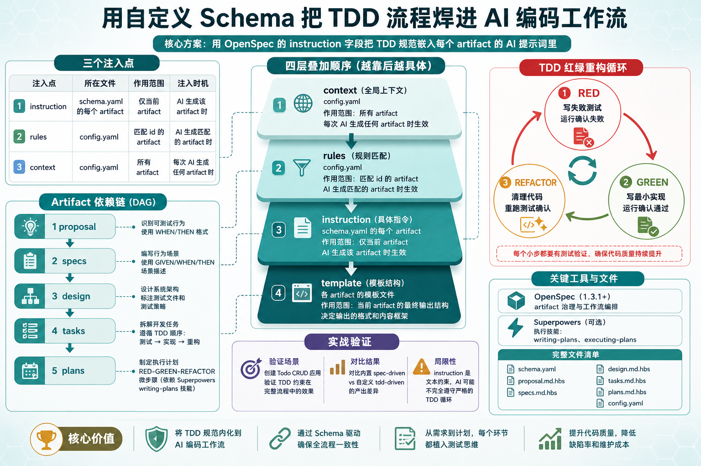
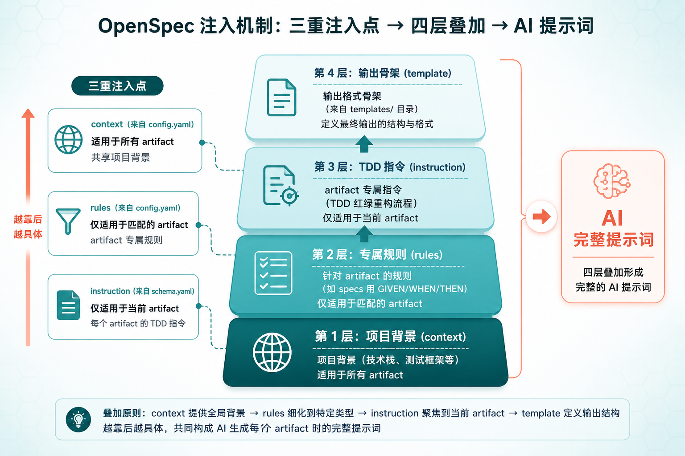
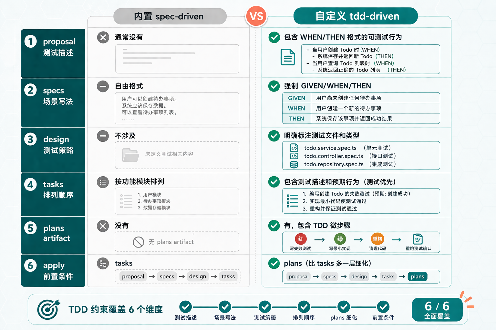
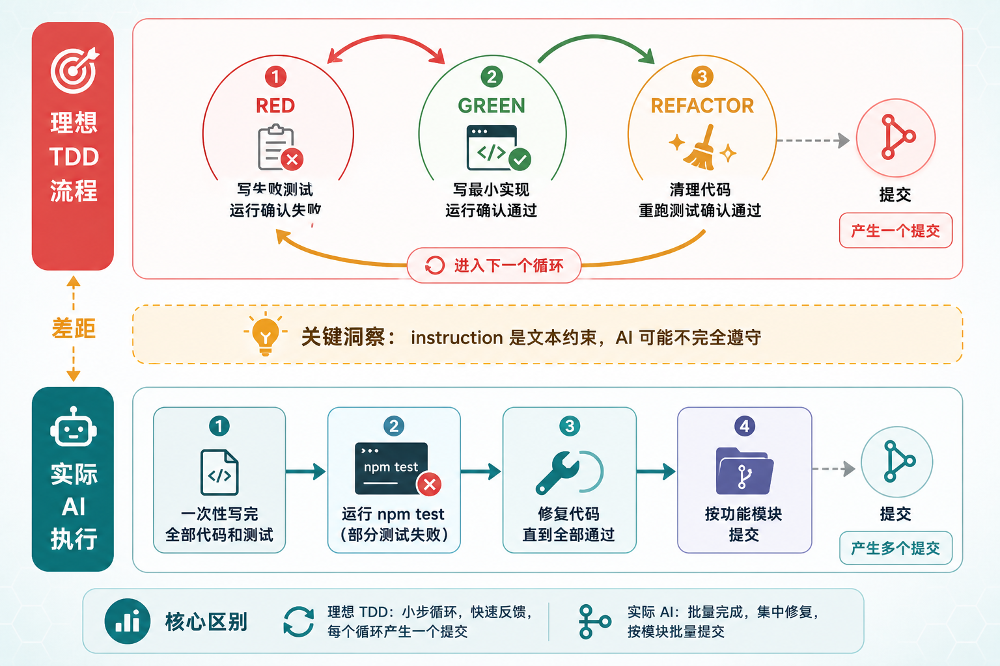

# 3 个注入点 + 4 层叠加 ：用 OpenSpec Schema 把 Superpowers TDD 焊进编码工作流（实测一半有效）

> 🚩 2026 年「术哥无界」系列实战文档 X 篇原创计划 第 _102_ 篇，AI 编程最佳实战「2026」系列第 _27_
> 大家好，欢迎来到 __术哥无界 | ShugeX ｜ 运维有术__。
> 我是__术哥__，一名专注于 AI 编程、AI 智能体、Agent Skills、MCP、云原生、AIOps、Milvus 向量数据库的__技术实践者与开源布道者__！
> __Talk is cheap, let's explore。无界探索，有术而行。__



_图 1：OpenSpec Schema + Superpowers TDD 工作流示意图_

读完后你会拿到一个完整的 `schema.yaml`，把它放进项目里，AI 就会在 propose 阶段按 TDD 思路写 spec，在 apply 阶段按 plan-driven 流程执行——不用手动编排，不用在两个工具之间来回切换。

先说结论：这个方案在__规划阶段__（propose）是有效的——自定义 schema 通过 `instruction` 字段确实改变了 AI 产出 specs、tasks、plans 的内容和格式。但在__执行阶段__（apply），instruction 是文本提示不是硬约束，AI 不会严格遵守 TDD 的红绿重构循环。所以这篇文章的定位是：教你用 OpenSpec 的自定义 schema 机制改善 AI 编码工作流的__规划质量__，而不是强制 AI 的编码行为。

> __说明__：本文内容基于 OpenSpec 源码（Fission-AI/OpenSpec）、Superpowers 源码（obra/superpowers）和实际操作验证分析整理而成。实测已完成 propose 和 apply 的完整流程，但 AI 执行路径并非严格的 TDD 循环。__文中的配置模板和参数建议仅供参考，实际效果请以你的业务数据和环境测试结果为准。__如果有实际使用经验，欢迎在评论区分享交流。

下面一步步来。

### 1. 你将完成什么

- ✅ 创建一个自定义 OpenSpec schema，在 artifact 生成阶段嵌入 TDD 规范
- ✅ 用这个 schema propose 一个 change，观察 AI 如何按 TDD 思路产出 spec 和 tasks
- ✅ 执行 apply，体验从 spec 到测试到实现的完整闭环
- ✅ 理解 OpenSpec 的 instruction/rules 注入机制

### 2. 环境准备

#### 2.1 你需要准备

- Claude Code（已安装 Superpowers 插件，可选）
- OpenSpec CLI（1.3.1+）
- Node.js 18+
- 一个空项目目录

> __关于 Superpowers__：它是可选依赖。本文的 `plans` artifact 会调用 Superpowers 的 `writing-plans` skill 来生成更细粒度的 TDD 微步骤，但如果你不装 Superpowers，其他 artifact 仍然能正常工作——只是 plan 的粒度会粗一些。具体取舍看后面"故障排除"的分析。

#### 2.2 安装 OpenSpec

```
# 全局安装 OpenSpec CLI
npm install -g openspec

# 确认版本
openspec --version
```

输出应该是纯数字，如 `1.3.1` 或更高。

#### 2.3 安装 Superpowers（可选）

在 Claude Code 中安装 Superpowers 插件，然后执行 `/reload-plugins` 刷新。

安装完成后，在 Claude Code 里输入 `/superpowers`，如果能看到 skill 列表就说明安装成功。

#### 2.4 预计时间

⏱️ 完成本实战大约需要 30 分钟

#### 2.5 难度等级

⭐⭐ 中级 - 需要了解 YAML 配置和基本的 CLI 操作

### 3. 第一步：创建自定义 Schema

为什么要自定义？OpenSpec 内置的 `spec-driven` schema 只管__写什么文档__，不管__按什么纪律写代码__。它的 proposal → specs → design → tasks 流程里没有任何 TDD 约束——AI 完全可能先写实现再补测试，甚至跳过测试。

我们的目标：用 `instruction` 字段告诉 AI，每个 artifact 都要体现 TDD 思路。

#### 3.1 创建 schema 目录

```
# 在项目根目录下创建 tdd-driven schema 的目录结构
mkdir -p openspec/schemas/tdd-driven/templates
```

#### 3.2 编写 schema.yaml（全文核心）

这是整篇文章最重要的文件。先搞清楚三个注入点的分工，再逐字段看 schema.yaml 的结构。

__三个核心注入点__：

|  |  |  |  |
| --- | --- | --- | --- |
| `instruction` | schema.yaml 的每个 artifact | 仅当前 artifact | AI 生成该 artifact 时 |
| `rules` | config.yaml | 匹配 id 的 artifact（如 `rules.specs` 只影响 specs） | AI 生成匹配的 artifact 时 |
| `context` | config.yaml | 所有 artifact | 每次 AI 生成任何 artifact 时 |

注入的叠加顺序是 `context → rules → instruction → template`。也就是说，AI 收到的 prompt 里先有项目背景，再有针对当前 artifact 的规则，再有 schema 里的指令，最后是模板骨架。四层叠加，越靠后越具体。



_图 2：context → rules → instruction → template 四层叠加机制_

__关键设计决策__：

1. artifacts 保持 4 个基础节点（proposal → specs → design → tasks），但每个的 `instruction` 都嵌入了 TDD 指引
2. 新增 `plans` artifact（依赖 tasks），用于创建 TDD 微步骤计划
3. apply 阶段的 `requires` 包含 plans，确保 plan 就绪后才开始实现
4. apply 的 `instruction` 引用 `executing-plans` 规范，让 AI 按 plan 执行

这里有个容易搞混的点：__依赖是赋能者，不是门控__。OpenSpec 的 DAG 依赖不会阻止你跳步。`requires: [proposal]` 的意思是 __proposal 的内容会作为上下文传入__，不是 __proposal 不存在就不让跑__。

完整 `schema.yaml`：

```
name: tdd-driven
version: 1
description: Spec-driven workflow with TDD discipline embedded at every artifact stage

artifacts:
  - id: proposal
    generates: proposal.md
    description: Initial change proposal
    template: proposal.md
    instruction: |
      Create a proposal that explains WHY this change is needed.
      Focus on the problem, not the solution.

      TDD REQUIREMENT:
      - Identify testable behaviors this change will introduce
      - List acceptance criteria in WHEN/THEN format
      - Do NOT describe implementation details
    requires: []

  - id: specs
    generates: specs/**/*.md
    description: Behavioral specifications for the change
    template: spec.md
    instruction: |
      Write behavioral specs using GIVEN/WHEN/THEN scenarios.

      TDD REQUIREMENT:
      - Each scenario must be independently testable
      - Express expected behavior, not implementation
      - Cover: happy path, edge cases, error cases
      - Reference existing patterns before creating new ones
    requires:
      - proposal

  - id: design
    generates: design.md
    description: Technical design document
    template: design.md
    instruction: |
      Create a technical design explaining HOW to implement.

      TDD REQUIREMENT:
      - Identify test files that need to be created or modified
      - Specify test strategy (unit, integration, e2e)
      - Design must support incremental testing
    requires:
      - proposal

  - id: tasks
    generates: tasks.md
    description: Implementation checklist with TDD ordering
    template: tasks.md
    instruction: |
      Break work into tasks following TDD order:
      1. Write failing test
      2. Write minimal implementation to pass
      3. Refactor
      4. Commit

      Each task must include:
      - Test description (what to test)
      - Expected behavior (what should happen)
      - Implementation notes (minimal code to pass)
    requires:
      - specs
      - design

  - id: plans
    generates: plan.md
    description: Detailed execution plan with TDD micro-steps
    template: plan.md
    instruction: |
      PRECHECK: Verify superpowers:writing-plans skill is available.
      If not available, STOP and report the missing skill.

      Create a detailed execution plan using 2-5 minute micro-tasks.
      Each task must follow the RED-GREEN-REFACTOR cycle:

      RED phase:
      - Write a specific failing test
      - Run it to confirm failure

      GREEN phase:
      - Write minimal code to make test pass
      - Run test to confirm pass

      REFACTOR phase:
      - Clean up without changing behavior
      - Re-run tests to confirm still passing

      Enforce YAGNI (You Aren't Gonna Need It) and DRY principles.
    requires:
      - tasks

apply:
  requires: [plans]
  tracks: tasks.md
  instruction: |
    Execute the plan following TDD discipline:

    1. For each task in plan.md:
       a. RED: Write failing test first
       b. GREEN: Write minimal implementation
       c. REFACTOR: Clean up code
       d. Run full test suite to confirm no regressions
       e. Commit with descriptive message

    2. After all tasks complete:
       a. Run full test suite
       b. Verify all specs are satisfied
       c. Check for any TODO markers left behind

    Rules:
    - Never write production code without a failing test
    - Never skip the RED phase
    - Commit after each GREEN phase
```

#### 3.3 创建模板文件

`templates/` 目录下需要为每个 artifact 提供模板骨架。模板的作用是给 AI 一个输出格式的起点——模板内容会作为 `<template>` 注入到 prompt 的最后一层。

```
# 创建模板文件
touch openspec/schemas/tdd-driven/templates/proposal.md
touch openspec/schemas/tdd-driven/templates/spec.md
touch openspec/schemas/tdd-driven/templates/design.md
touch openspec/schemas/tdd-driven/templates/tasks.md
touch openspec/schemas/tdd-driven/templates/plan.md
```

模板文件不需要太多内容，AI 会根据 instruction 填充。但给一个好的骨架能让 AI 的输出更稳定、格式更一致。

`proposal.md` 模板：

```
# Proposal

## Problem
<!-- 描述要解决的问题 -->

## Testable Behaviors
<!-- WHEN/THEN 格式列出可测试行为 -->

## Acceptance Criteria
<!-- 验收标准 -->
```

`tasks.md` 模板：

```
# Tasks

## TDD Task List

<!-- AI will populate tasks following RED-GREEN-REFACTOR order -->

### Task 1: [AI fills]
- [ ] RED: [test description]
- [ ] GREEN: [implementation notes]
- [ ] REFACTOR: [cleanup notes]
- [ ] Commit
```

`plan.md` 模板：

```
# Execution Plan

## Micro-tasks (2-5 min each)

### Phase 1: [AI fills]
- [ ] RED: ...
- [ ] GREEN: ...
- [ ] REFACTOR: ...
```

模板是纯文本，OpenSpec 不做变量插值。AI 会根据 instruction 自动填充内容，所以用 HTML 注释作为占位提示就够了。

#### 3.4 配置 project config

创建 `openspec/config.yaml`，让项目默认使用 `tdd-driven` schema：

```
schema: tdd-driven

context: |
  Tech stack: TypeScript, Node.js, Jest
  Testing framework: Jest
  API style: RESTful
  All new code must have corresponding tests.

rules:
  proposal:
    - Include testable acceptance criteria
    - Use WHEN/THEN format for expected behaviors
  specs:
    - Use GIVEN/WHEN/THEN format
    - Each scenario must be independently testable
    - Reference existing patterns before inventing new ones
  tasks:
    - Order tasks by TDD cycle: test → implement → refactor
    - Each task must have a test description
  plans:
    - Break each task into 2-5 minute micro-steps
    - Every step must produce a testable outcome
```

注意 `context` 和 `rules` 的分工：

- __context__：所有 artifact 共享的信息（技术栈、测试框架等）
- __rules__：只注入到匹配 id 的 artifact（比如 `rules.specs` 只出现在 specs 的 prompt 里）

注入顺序是 `context → rules → instruction → template`，四层叠加。

#### 3.5 初始化项目

```
# 初始化 OpenSpec（--tools 参数配置 AI 工具适配，按需选择）
openspec init --tools claude
```

`--tools` 参数需要传值：`all` 配置全部工具，`claude` 只配置 Claude Code，也可以传逗号分隔的列表如 `claude,cursor`。

#### 验证点

> __提示__：`schema` 系列命令目前是实验性功能，执行时会显示 `Note: Schema commands are experimental and may change.` 提示，这是正常的。

```
# 检查 schema 文件是否存在
openspec schema which tdd-driven

# 验证 schema 语法
openspec schema validate tdd-driven

# 检查项目状态
openspec status
```

✅ `schema.yaml` 存在且语法正确

✅ 模板文件齐全（5 个）

✅ `config.yaml` 指向 `tdd-driven` schema

✅ `openspec status` 不报错

到这里，骨架搭好了。接下来让它跑起来。

### 4. 第二步：Propose 一个 Change

用一个从零开始的示例来验证 TDD 约束是否生效。我们来创建一个 Todo CRUD 应用——支持创建、查看、完成、删除待办事项。

#### 4.1 执行 propose

```
# 创建新 change
/opsx:propose todo-crud
```

执行后，AI 会根据 change 名称自动推断需求，按 DAG 依赖顺序依次生成所有 artifact——不需要手动描述需求，不需要逐步确认。

它会自动完成以下步骤：

1. 调用 `openspec new change` 创建 change 目录
2. 按依赖顺序读取每个 artifact 的 instruction
3. 依次生成 proposal → design → specs → tasks → plans
4. plans 生成时会自动调用 Superpowers 的 `writing-plans` skill

整个过程大约 2-5 分钟，完成后你会看到 5 个文件出现在 `openspec/changes/todo-crud/` 目录下。

#### 4.2 观察关键差异

这是验证自定义 schema 是否生效的核心环节。对比一下用自定义 schema 和内置 `spec-driven` schema 的产出差异：

|  |  |  |
| --- | --- | --- |
| proposal 里的测试描述 | 通常没有 | 包含 WHEN/THEN 格式的可测试行为 |
| specs 的场景写法 | 自由格式 | 强制 GIVEN/WHEN/THEN |
| design 里的测试策略 | 不涉及 | 明确标注测试文件和测试类型 |
| tasks 的顺序 | 按功能模块排列 | 包含测试描述和预期行为 |
| 是否有 plans | 没有 | 有，包含 TDD 微步骤 |
| apply 的前置条件 | tasks | plans（比 tasks 多一层细化） |



_图 3：内置 spec-driven vs 自定义 tdd-driven 六维度对比_

__重点看 `tasks.md`__——如果 TDD 约束生效了，你会看到类似这样的结构：

```
### Task 2: Create TodoStore class

**Test description**: Test TodoStore.create() with valid title

**Expected behavior**: Returns a new Todo with generated UUID, current timestamps, completed=false

**Implementation notes**:
- Create `src/store.ts`
- Export `class TodoStore`
```

每个 task 都包含测试描述和预期行为，而不是直接跳到实现细节。对比内置 schema 产出的：

```
### Task 1: 创建 Todo 接口
实现 POST /todos 路由...
```

区别：前者每步都先定义测试预期，后者直接写实现。具体的 RED-GREEN-REFACTOR 微步骤在 `plan.md` 中展开。

__再看 `plan.md`__——这是内置 schema 根本不会生成的 artifact。它把 tasks 进一步拆成详细的 TDD 微步骤，包含完整的测试代码和实现代码示例：

```
## Task 2: Create TodoStore with create()

- [ ] **Step 1: Write failing test for TodoStore.create()**
      （附完整测试代码）

- [ ] **Step 2: Run test to verify it fails**

- [ ] **Step 3: Write minimal TodoStore with create()**
      （附完整实现代码）

- [ ] **Step 4: Run test to verify it passes**
```

plan.md 生成时 AI 会自动调用 Superpowers 的 `writing-plans` skill，所以粒度比普通 instruction 生成的要细得多——每个 task 都有明确的 RED → GREEN 步骤和可运行的代码。

#### 4.3 查看 artifact instructions

想确认 instruction 是否被正确注入，可以用 CLI 检查：

```
# 查看 specs artifact 的完整 instruction
openspec instructions specs --change todo-crud --json
```

这个命令会显示 AI 在生成 specs 时收到的完整指令。输出应该包含四个部分：

1. `<context>` - 来自 config.yaml 的项目背景
2. `<rules>` - 来自 config.yaml 的 specs 专属规则
3. `<instruction>` - 来自 schema.yaml 的 specs instruction
4. `<template>` - 来自 templates/spec.md 的模板骨架

如果你只看到 instruction 但没看到 context 和 rules，检查一下 `config.yaml` 的位置是否正确（必须在 `openspec/` 目录下）。

> __注意__：在验证中发现 `openspec instructions` 命令输出了 `Rules for 'tasks' must be an array of strings` 警告。虽然 config.yaml 中 tasks 的 rules 确实是数组格式，但该警告可能影响 rules 的注入效果。如果发现 tasks 的 TDD 约束没有生效，可以尝试简化 rules 内容。

#### 验证点

✅ specs 中的 scenario 使用 GIVEN/WHEN/THEN 格式

✅ tasks 中包含测试描述和预期行为

✅ plans artifact 已生成

✅ `openspec status --change todo-crud` 显示所有 artifact 状态

### 5. 第三步：Apply（体验 TDD 闭环）

前两步都是在写文档和计划，这一步是真正写代码。

#### 5.1 执行 apply

```
# 开始按 plan 执行
/opsx:apply todo-crud
```

注意 apply 的 `requires` 是 `plans` 而不是 `tasks`——这意味着 plan.md 的内容会作为上下文传入 apply 阶段。但 OpenSpec 的设计是"依赖是赋能者，不是门控"，所以即使 plan 没生成，apply 也不一定会被阻止。

执行 `/opsx:apply todo-crud` 后，AI 会加载 `superpowers:executing-plans` skill，然后按照 plan.md 的内容编写代码。

#### 5.2 观察执行行为

在实际执行中，AI 的行为可能和你想的不一样。在验证中观察到的是：

1. AI 先把所有源码文件和测试文件一次性写完（types.ts、store.ts、errorHandler.ts、routes.ts、test/*.test.ts）
2. 然后运行 `npm test`，部分测试失败
3. 通过 Edit 修复代码，再运行测试直到全部通过
4. 最后提交代码

这__不是__严格的 TDD RED-GREEN-REFACTOR 循环。AI 没有先写一个失败测试、运行确认失败、再写最小实现。它更像是一次性写完再用测试验证。



_图 4：理想 TDD RED-GREEN-REFACTOR 循环 vs 实际 AI 线性执行_

说实话，这里有个不能回避的问题：instruction 是__文本指令__，不是硬约束。AI 可能不遵守。

比如它可能一口气把测试和实现全写了，跳过了 RED 阶段先跑测试的步骤。或者它可能在 GREEN 阶段写了超出__最小实现__范围的代码。这不是 bug——这是当前 LLM 的固有局限。instruction 的约束力取决于模型的指令遵循能力。

所以 apply 之后一定要__人工检查__。

#### 5.3 中途验证

```
# 查看 change 的执行状态
openspec status --change todo-crud
```

这个命令会显示当前 change 的所有 artifact 状态。

输出类似：

```
Change: todo-crud
Schema: tdd-driven
Progress: 5/5 artifacts complete
[x] proposal
[x] design
[x] specs
[x] tasks
[x] plans
```

这是 artifact 级别的完成状态。注意：tasks.md 内部的任务进度（如 checkbox 勾选）取决于 AI 是否按计划逐个执行任务——在验证中，AI 是一次性写完所有代码的，所以这里看不到逐步推进的过程。

另外，检查文件系统的变化——确认测试文件确实存在：

```
# 查看文件创建时间顺序
ls -lt src/**/*.ts 2>/dev/null | head -10
```

还有一个验证方式：检查 git log 的提交记录。

在验证中，提交记录是这样的：

```
feat: add Express server entry point
feat: add global error handler middleware
feat: implement Todo CRUD routes
feat: add in-memory Todo store
feat: add Todo type with timestamps
```

注意：__没有交替的 test/feat 提交__。AI 按功能模块提交，测试和实现在同一个 commit 中。这再次说明 instruction 的 TDD 约束没有完全生效。

#### 验证点

✅ 代码变更包含测试文件

✅ 测试文件存在（检查文件列表）

✅ 所有测试通过

✅ git log 中有按功能模块的提交记录

### 6. 故障排除

#### 6.1 问题 1：AI 跳过了 TDD 步骤

__现象__：apply 完成后，发现测试和实现是同时写的，或者根本没有测试。

__原因__：instruction 是文本提示，不是硬性约束。模型可能忽略。

__实测案例__：在验证 Todo CRUD 的过程中，AI 一次性写完了所有源码（types.ts、store.ts、errorHandler.ts、routes.ts）和所有测试（store.test.ts、routes.test.ts），然后才运行 `npm test`。没有 RED→GREEN→REFACTOR 循环。最终结果是测试全部通过，但执行路径不是严格的 TDD。

__解决思路__：

- 在 `config.yaml` 的 `rules` 里加更具体的规则，比如 `Never create a .ts file without a corresponding .test.ts file`
- 把 tasks 拆得更细，每个 task 只包含一个 RED 或 GREEN 步骤
- 在 apply 的 instruction 里加更强的措辞，比如 `STOP if no failing test exists before writing production code`

#### 6.2 问题 2：plans artifact 太长或被截断

__现象__：plan.md 生成后内容不完整。

__原因__：复杂的 change 可能产生大量微步骤，超出模型的输出长度限制。

__解决思路__：

- 在 plans 的 instruction 里加限制：`Maximum 15 micro-tasks per plan. Split into multiple phases if needed.`
- 在 proposal 阶段就把 change 的范围收窄

#### 6.3 问题 3：PRECHECK 失败

__现象__：plans artifact 的 instruction 里有 PRECHECK 检测 Superpowers skill，如果 skill 不存在会 STOP。

__原因__：Superpowers 插件没装或者版本不匹配。

__解决思路__：

- 在 Claude Code 里执行 `/superpowers` 确认 skill 列表中有 `writing-plans`
- 如果不想依赖 Superpowers，把 plans 的 instruction 里的 PRECHECK 和 skill 引用删掉，改用纯文本指令

#### 6.4 问题 4：不想依赖 Superpowers，只用纯 instruction

__现象__：你没有安装 Superpowers，或者想用其他 AI 编码工具（Cursor、Codex 等）。

__解决思路__：

把 `plans` artifact 的 instruction 里的 PRECHECK 行删掉，把 `superpowers:writing-plans` 的引用也删掉。改成纯文本的 TDD 指令就够了。schema.yaml 里的 instruction 本身就是纯文本，不依赖任何插件。OpenSpec 官方支持 25+ 种 AI 编码工具，schema 机制在所有平台上都通用。

这也是 OpenSpec 自定义 schema 的设计初衷：__instruction 是纯文本，任何 LLM 都能读懂__。Superpowers 只是提供了更精细的 TDD 微步骤方法论，你可以按需取舍。

### 7. 完整文件清单

```
openspec/
├── config.yaml                          # 项目配置
└── schemas/
    └── tdd-driven/
        ├── schema.yaml                  # 核心：artifact DAG + instruction
        └── templates/
            ├── proposal.md
            ├── spec.md
            ├── design.md
            ├── tasks.md
            └── plan.md
```

### 总结

#### 方案结论：Propose 有效，Apply 的 TDD 循环未生效

用 Todo CRUD 应用做了完整验证，结论如下：

|  |  |  |
| --- | --- | --- |
| __Propose（规划阶段）__ | ✅ 有效 | specs 用了 WHEN/THEN、tasks 包含测试描述和预期行为、plans 自动调用了 Superpowers 的 `writing-plans` skill 生成 1098 行详细计划 |
| __Apply（执行阶段）__ | ❌ TDD 循环未生效 | AI 一次性写完所有源码和测试再跑 `npm test`，没有 RED→GREEN→REFACTOR 循环，git log 中没有交替的 test/feat 提交 |

__结论__：这个方案在__规划阶段__是有效的——自定义 schema 通过 `instruction` 字段确实影响了 AI 产出 artifact 的内容和格式，让 specs、tasks、plans 都带上了 TDD 痕迹。但到了__执行阶段__，instruction 是文本提示而非硬约束，AI 仍然会按自己的节奏写代码，不会严格遵守 TDD 红绿重构循环。

#### 什么时候值得用

- ✅ __想让 AI 写出更规范的 spec 和 tasks__：有效。instruction 能显著改善 propose 阶段的产出质量
- ✅ __想给团队统一 artifact 的输出格式__：有效。WHEN/THEN、测试描述等格式约束可以稳定注入
- ✅ __想用 OpenSpec 管理复杂项目的变更流程__：有效。五个 artifact 的 DAG 治理本身就有价值
- ❌ __想强制 AI 按 TDD 严格循环执行代码__：无效。instruction 约束不了 apply 阶段的代码编写顺序

#### 方案的本质

OpenSpec 负责"做什么"（artifact 治理），Superpowers 负责"怎么做"（执行技能）。两者通过 `instruction` 字段桥接——不需要改任何一方的源码。

三个注入点分工明确：

- __instruction__（schema.yaml）：每个 artifact 的专属指令，嵌入 TDD 红绿重构循环
- __rules__（config.yaml）：针对特定 artifact 的附加规则
- __context__（config.yaml）：所有 artifact 共享的项目背景

这个桥接机制本身是通的，价值也实在。只是别指望它能在执行阶段强制 AI 的编码行为——那是 LLM 指令遵循能力的边界，不是 schema 设计的问题。

你在项目中用过类似的方案吗？比如用自定义 schema 约束 AI 的编码行为？欢迎在评论区聊聊。

__好啦，谢谢你观看我的文章，如果喜欢可以点赞转发给需要的朋友，我们下一期再见！敬请期待！__


来源：https://cloud.tencent.com/developer/article/2664184